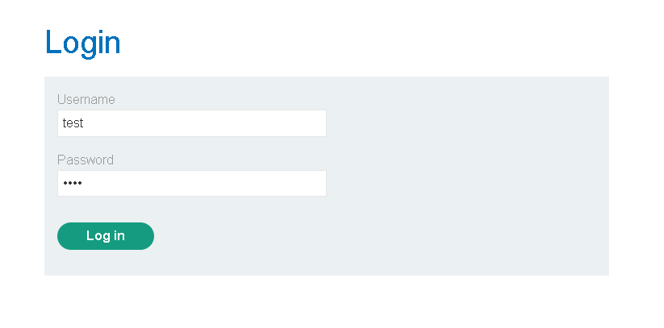
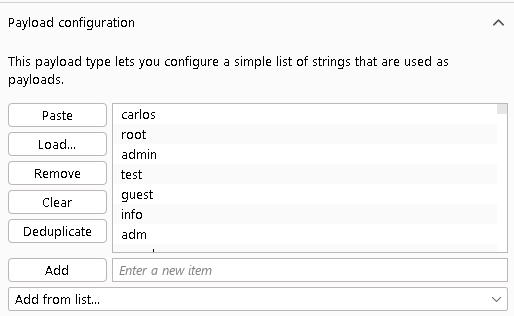

# 🔐 Authentication, Authorization & Their Vulnerabilities — A Complete Guide

> A detailed reference explaining how authentication and authorization work, why authentication mechanisms break in practice, and how attackers exploit those weaknesses — with real-world examples, illustrative scenarios, and defensive best practices.

---

## Table of Contents

1. [What Is Authentication?](#1-what-is-authentication)
2. [Authentication vs. Authorization](#2-authentication-vs-authorization)
3. [How Do Authentication Vulnerabilities Arise?](#3-how-do-authentication-vulnerabilities-arise)
4. [The Real-World Impact of Broken Authentication](#4-the-real-world-impact-of-broken-authentication)
5. [Password-Based Login: The Weakest Link](#5-password-based-login-the-weakest-link)
6. [Brute-Force Attacks Explained](#6-brute-force-attacks-explained)
7. [Brute-Forcing Usernames](#7-brute-forcing-usernames)
8. [Brute-Forcing Passwords](#8-brute-forcing-passwords)
9. [Username Enumeration](#9-username-enumeration)
10. [How Enumeration Is Detected: Status Codes, Errors & Timing](#10-how-enumeration-is-detected-status-codes-errors--timing)
11. [Related Attack Variants Worth Knowing](#11-related-attack-variants-worth-knowing)
12. [Defensive Best Practices](#12-defensive-best-practices)
13. [Quick Reference Tables](#13-quick-reference-tables)
14. [Hands-On Lab Walkthrough: Username Enumeration via Different Responses](#14-hands-on-lab-walkthrough-username-enumeration-via-different-responses)
15. [Conclusion](#15-conclusion)

---

## 1. What Is Authentication?

Authentication is the checkpoint that answers one question: **"Are you really who you say you are?"** Every time a system asks for a login, a fingerprint, or a one-time code, it's trying to confirm the identity of the person on the other end before letting them any further.

Because almost any website or app is reachable by anyone with an internet connection, this checkpoint is one of the most important defensive layers in the entire system. If it's weak, everything built behind it — user data, business logic, admin panels — is only as secure as that front door.

Security professionals generally group authentication methods into three "factors":

| Factor | Description | Examples |
|---|---|---|
| **Knowledge** ("something you know") | A secret only the real user should know | Password, PIN, security question answer |
| **Possession** ("something you have") | A physical or digital object the user holds | Phone, hardware security key, smart card, authenticator app |
| **Inherence** ("something you are/do") | A trait tied to the user's body or behavior | Fingerprint, face scan, voice pattern, typing rhythm |

Combining two or more of these factors is what people mean by **multi-factor authentication (MFA)** — a password alone is one factor, but a password *plus* a code from your phone is two.

**🧩 Real-life example:** When you unlock your phone with Face ID and then open your banking app which asks for a fingerprint *and* sends a one-time SMS code before letting you transfer money, you're experiencing layered authentication: inherence (face/fingerprint) plus possession (the phone receiving the SMS). Each layer makes it progressively harder for someone who isn't you to get through.

---

## 2. Authentication vs. Authorization

These two terms get used interchangeably in casual conversation, but they solve completely different problems:

- **Authentication** = proving *who* you are.
- **Authorization** = deciding *what you're allowed to do* once your identity is established.

Authentication always happens first. Authorization is the set of rules applied afterward, based on the identity that authentication confirmed.

**🧩 Real-life example:** Think of checking into a hotel. At the front desk, staff verify your ID and match it to a reservation — that's *authentication*. Once confirmed, they hand you a key card that opens your specific room, the gym, and the pool, but not the other guests' rooms or the staff-only areas — that's *authorization*. You proved who you were once; what you can unlock afterward is a separate, ongoing decision the hotel's systems make every time you tap that card.

In web terms: logging into `amazon.com` as `sarah_k` is authentication. Whether `sarah_k` can view *her own* order history but not someone else's, or whether she can access the seller-admin dashboard, is authorization — and a flaw in authorization is what lets one user peek at another user's private data even though they logged in completely legitimately.

---

## 3. How Do Authentication Vulnerabilities Arise?

Authentication mechanisms tend to break down for two broad reasons:

1. **Weak protection against automated guessing.** The system technically works correctly, but nothing stops an attacker from trying thousands or millions of username/password combinations until one succeeds.
2. **Logic flaws in the implementation ("broken authentication").** The mechanism itself has a bug or oversight that lets an attacker skip or subvert the login process entirely — not by guessing, but by exploiting a mistake in how it was built.

The second category is particularly dangerous because, unlike a general web-app bug that might just cause an error message, a logic flaw in *authentication specifically* almost always translates directly into a security hole — there's no such thing as a "harmless" way to bypass a login.

**🧩 Real-life example (weak protection):** A login form that allows unlimited attempts with no delay, lockout, or CAPTCHA — an attacker can script thousands of password guesses per minute against it.

**🧩 Real-life example (logic flaw):** A "forgot password" flow where the reset link contains a predictable or user-controllable parameter like `reset.php?user=sarah_k`. If the server doesn't verify that the person requesting the reset actually owns that account, an attacker can simply change the parameter to `reset.php?user=admin` and hijack another person's account without guessing a single password.

---

## 4. The Real-World Impact of Broken Authentication

The consequences of broken authentication scale with the privilege of the compromised account, but even "low-value" accounts are rarely harmless to lose:

- **Compromising a high-privilege account** (e.g., a system administrator) can hand an attacker control of the entire application, its data, and sometimes the underlying infrastructure it runs on.
- **Compromising a low-privilege account** can still expose sensitive information the account has legitimate access to (internal notes, billing details, other users' partially visible data).
- Even an account with *no* interesting data of its own can be a stepping stone — it might unlock internal-only pages that were never meant to be reachable from the public internet, giving the attacker a new attack surface to explore that wasn't accessible before logging in at all.

**🧩 Real-life example:** In 2020, several major hospitality and streaming platforms suffered **credential stuffing** waves — attackers took username/password pairs leaked from *unrelated* breaches and tried them en masse against login pages, banking on the fact that many people reuse passwords across sites. Accounts with no "sensitive" data still got compromised and resold simply because they granted access to loyalty points, saved payment methods, or internal support tools.

---

## 5. Password-Based Login: The Weakest Link

Most websites still rely on the oldest authentication pattern: a username paired with a secret password. The entire security model rests on one assumption — **that only the legitimate user knows that password.** The moment that assumption breaks (through guessing, leaking, or reuse), the account's security collapses along with it.

This is why password-based systems are the most heavily targeted authentication mechanism on the web, and why the next several sections dig into exactly how attackers go after them.

**🧩 Real-life example:** A small business sets up a office Wi-Fi router and never changes the factory-default login (`admin` / `admin`). Anyone within range — a visitor, a neighbor, a delivery courier — can access the router's admin panel using credentials published in the router's own manual online. This is password-based authentication at its weakest: the "secret" was never actually secret.

---

## 6. Brute-Force Attacks Explained

A **brute-force attack** is a trial-and-error method of guessing valid credentials, almost always automated with scripts or specialized tools that can fire off enormous numbers of login attempts in a short time.

Brute-forcing doesn't have to mean *purely random* guessing. Attackers routinely combine automation with human intuition — using wordlists built from leaked password databases, common patterns, or publicly available information about the target — which makes the attack far more efficient than blind chance.

**🧩 Real-life example:** The **Mirai botnet** (2016), one of the most disruptive IoT attacks in history, spread by automatically brute-forcing a short hardcoded list of default username/password combinations (`admin`/`admin`, `root`/`12345`, etc.) against internet-connected cameras and routers. Because so many devices never had their default credentials changed, the "brute force" barely needed to try more than a few dozen combinations to compromise hundreds of thousands of devices.

---

## 7. Brute-Forcing Usernames

Usernames are often far easier to guess than people assume, especially when they follow a predictable format.

- Corporate logins frequently use the pattern `firstname.lastname@company.com`, which can often be derived just by knowing someone's name and employer (easily found on LinkedIn, a company "About Us" page, or an email signature).
- High-privilege accounts are sometimes given predictable names like `admin`, `administrator`, or `root` purely out of convenience during setup — and never renamed.
- Websites can accidentally leak valid usernames through features that seem unrelated to login at all: public user profiles, forum post authorship, or even email addresses embedded in HTTP responses (like a "reply-to" support address).

**🧩 Real-life example:** A company's public support forum displays "Posted by: `jdoe`" under every ticket. That same `jdoe` also happens to be the login username for the company's internal ticketing system. An attacker doesn't need to guess the username at all — the forum handed it over for free.

---

## 8. Brute-Forcing Passwords

Password strength requirements exist specifically to make brute-forcing harder — length minimums, mixed case, special characters, and so on are meant to increase the number of possible combinations an attacker has to try. But **policy compliance and true unpredictability are not the same thing.**

Humans tend to take a memorable password and bend it just enough to satisfy the rules, rather than creating something genuinely random. A password like `mypassword` becomes `Mypassword1!` when the site demands a capital letter, a number, and a symbol — technically compliant, but barely harder to guess than the original.

The same happens with forced password rotation: `Summer2024!` becomes `Summer2025!` the following year, or `Mypassword1!` becomes `Mypassword2!` after a forced reset. Attackers who know a user's *old* leaked password can often guess the *new* one just by trying small, predictable variations.

**🧩 Real-life example:** The 2012 LinkedIn breach exposed roughly 6.5 million password hashes. Because many users had chosen simple, guessable base passwords (and LinkedIn's hashing at the time used unsalted SHA-1, making cracking dramatically faster), security researchers were able to crack a huge percentage of those hashes within days using nothing more exotic than large precomputed wordlists — proof that "password policy compliant" and "actually strong" are very different things.

---

## 9. Username Enumeration

**Username enumeration** is a technique where an attacker doesn't guess a username directly — instead, they watch how the website *reacts* to different inputs and use those reactions to figure out which usernames actually exist in the system.

This typically shows up in two places:

- **Login forms** — entering a valid username with a wrong password often behaves differently than entering an invalid username altogether.
- **Registration/sign-up forms** — trying to register with a username that's already taken often triggers a distinct "this username is already in use" message, which is a free confirmation that the account exists.

Once an attacker has a confirmed list of real usernames, they've cut their brute-force problem in half — instead of guessing *both* username and password together, they only need to guess passwords against a known-valid set of accounts, which is dramatically faster and more efficient.

**🧩 Real-life example:** A dating app's sign-up page instantly shows "That username is taken!" the moment you type an existing handle, before you even submit the form. An attacker can script through a list of guessed usernames purely to build a database of "real" accounts on the platform — never even touching the password field.

---

## 10. How Enumeration Is Detected: Status Codes, Errors & Timing

Even when a website *tries* to hide whether a username is valid, small implementation inconsistencies often leak the answer anyway. The three classic tells are:

### a) HTTP Status Codes
If 999 out of 1,000 login attempts return the same status code (say, `401 Unauthorized`), but one particular guess returns something different (like a `200 OK` before an error page loads, or a `500` from an unexpected code path), that's a strong signal the username behind that anomaly is real.

### b) Error Message Wording
Best practice is a single generic message like *"Invalid username or password"* regardless of which part was wrong. In practice, sites often accidentally implement two subtly different messages — *"Invalid username"* vs. *"Invalid password"* — and even a one-character difference (extra whitespace, a missing period) is enough for automated tooling to tell them apart, even if a human eye wouldn't easily notice.

### c) Response Timing
If checking a password only happens *after* confirming the username exists, valid usernames will take measurably longer to respond than invalid ones (because the server does extra work — like hashing comparisons — that it skips for a username it already knows is wrong). Attackers can exaggerate this gap by submitting an unusually long password, since operations like hashing scale with input size, making the timing difference easier to detect over many repeated requests.

**🧩 Illustrative example (not tied to a real site):**

```
Request: username=real_user      &password=wrongpass   → 401, "Invalid password",   612ms
Request: username=fake_user_xyz  &password=wrongpass   → 401, "Invalid username",   89ms
```

Even though both responses use the same `401` status code, the differing message text *and* the ~500ms timing gap both independently confirm that `real_user` exists and `fake_user_xyz` does not — exactly the kind of subtle leak that a careful security review looks for.

---

## 11. Related Attack Variants Worth Knowing

Brute-forcing isn't a single technique — it has several well-known flavors, each suited to a different scenario:

| Variant | How it works | When attackers use it |
|---|---|---|
| **Dictionary attack** | Tries words from a curated wordlist (common passwords, leaked breach data) instead of pure random combinations | Fast, efficient first pass before resorting to exhaustive brute force |
| **Credential stuffing** | Reuses real username/password pairs leaked from *other* breaches | Exploits password reuse across multiple sites |
| **Password spraying** | Tries one or two common passwords (e.g. `Welcome1!`) across *many* usernames, instead of many passwords against one username | Avoids per-account lockouts that trigger after repeated failures on a single account |
| **Reverse brute force** | Fixes a known/likely password and iterates through usernames | Effective when a specific weak default password is suspected across an organization |
| **Rainbow table attack** | Uses precomputed hash lookups to reverse *stolen* password hashes (not attacking the live login form at all) | Used after a database of hashed passwords has already been leaked |

---

## 12. Defensive Best Practices

No single fix solves authentication security — real protection comes from layering several defenses together:

- **Rate limiting & progressive delays** — slow down repeated failed attempts from the same IP, account, or device fingerprint instead of allowing unlimited instant retries.
- **Account lockout, used carefully** — locking an account after repeated failures helps, but overly aggressive lockout policies can themselves be abused to lock *legitimate* users out (a denial-of-service side effect), so it's usually paired with CAPTCHAs or temporary cool-downs rather than permanent locks.
- **CAPTCHA / proof-of-work challenges** — make large-scale automation slower and more expensive to run.
- **Multi-factor authentication (MFA)** — even if a password is fully compromised, a second factor (authenticator app, hardware key, biometric) stops most automated takeovers cold.
- **Generic, identical responses** — same status code, same wording, same rough response time, regardless of whether the username, the password, or both were wrong. This directly closes the enumeration gap described in Section 10.
- **Constant-time comparisons** — deliberately normalizing processing time so correct and incorrect guesses take the same amount of server time.
- **Strong password storage** — passwords should never be stored in plaintext or with fast, unsalted hashes like raw MD5/SHA-1. Modern systems use slow, salted algorithms specifically designed for password hashing, such as **bcrypt**, **scrypt**, or **Argon2**.
- **Breach-aware password policies** — modern guidance (e.g. NIST SP 800-63B) leans toward checking new passwords against known-breached password lists (such as via the "Have I Been Pwned" API) rather than forcing arbitrary complexity rules, since real-world entropy matters more than superficial character requirements.
- **Monitoring & alerting** — flagging unusual login patterns (impossible travel, a sudden burst of failed logins, logins at odd hours) so a human or automated system can respond before damage is done.
- **Minimizing information leakage elsewhere** — auditing public profile pages, forum posts, and HTTP response headers for anything that inadvertently reveals valid usernames or internal account details.

---

## 13. Quick Reference Tables

### Authentication Factors at a Glance

| Factor Type | Question It Answers | Common Examples |
|---|---|---|
| Knowledge | What do you *know*? | Password, PIN |
| Possession | What do you *have*? | Phone, hardware token |
| Inherence | What are you? | Fingerprint, face scan |

### Authentication vs. Authorization

| | Authentication | Authorization |
|---|---|---|
| **Question answered** | Who are you? | What can you do? |
| **Happens** | First, at login | After identity is confirmed, on every action |
| **Failure example** | Someone logs in as you | You access data/features you shouldn't be able to |

### Attack Variant Cheat-Sheet

| Attack | Target | Defense |
|---|---|---|
| Brute force | One account, many passwords | Rate limiting, lockout, CAPTCHA |
| Password spraying | Many accounts, one common password | Monitor for spray patterns across accounts |
| Credential stuffing | Reused leaked credentials | MFA, breach-aware password checks |
| Username enumeration | Confirming valid accounts | Uniform errors, status codes, and timing |

---

## 14. Hands-On Lab Walkthrough: Username Enumeration via Different Responses

> This section puts Sections 9 and 10 into practice: a step-by-step walkthrough of using Burp Suite to solve a deliberately vulnerable training lab whose login page leaks which usernames are valid through subtly different responses.

**Lab setup:** a login page with predictable credentials, plus full candidate lists for both usernames and passwords (see below). The goal: find the one valid username, brute-force its password, and log in.

### Step 1 — Capture a baseline login request

Open the lab's login page, enter a throwaway value in both fields (e.g. `test` / `test`), and submit it **with Burp's Intercept turned on** so the raw POST request is captured before it reaches the server.



This confirms the exact structure of the request — which parameter is `username`, which is `password`, and what the request looks like in full.


### Step 2 — Send to Intruder and mark the username as the payload position

Right-click the intercepted request → *Send to Intruder*. In the Positions tab, clear the auto-suggested markers and place a single payload marker around the `username` value only — leave `password` as a fixed placeholder for now, since this phase is only trying to find out *which usernames exist*, not which passwords work.


### Step 3 — Load the username wordlist, attack type: Sniper

With **Sniper** selected as the attack type (only one position is varying), go to the Payloads tab, keep "Simple list" as the payload type, and paste in the full candidate username list the lab provides.



<details>
<summary>Candidate usernames (click to expand)</summary>

```
carlos, root, admin, test, guest, info, adm, mysql, user, administrator,
oracle, ftp, pi, puppet, ansible, ec2-user, vagrant, azureuser, academico,
acceso, access, accounting, accounts, acid, activestat, ad, adam, adkit,
admin, administracion, administrador, administrator, administrators, admins,
ads, adserver, adsl, ae, af, affiliate, affiliates, afiliados, ag, agenda,
agent, ai, aix, ajax, ak, akamai, al, alabama, alaska, albuquerque, alerts,
alpha, alterwind, am, amarillo, americas, an, anaheim, analyzer, announce,
announcements, antivirus, ao, ap, apache, apollo, app, app01, app1, apple,
application, applications, apps, appserver, aq, ar, archie, arcsight,
argentina, arizona, arkansas, arlington, as, as400, asia, asterix, at,
athena, atlanta, atlas, att, au, auction, austin, auth, auto, autodiscover
```
</details>

### Step 4 — Run the attack and look for the outlier response length

Start the attack and let it work through every candidate. Burp shows the **response length** (and status code) for each attempt in a results table. Almost every wrong username produces an *identical* response length, because the server sends back the same generic error page. The one username that behaves even slightly differently — a few bytes longer or shorter, because the underlying error message text changes even if it *looks* the same on screen — is your signal.

In this run, that outlier was **`alerts`**.


This is exactly the "subtly different response" idea from Section 10 in action: the developers likely intended both error paths to look identical to a human reading the page, but the raw HTTP response bodies differ by a small, measurable amount — invisible to a person eyeballing the page, but very visible when Burp lines up every response side-by-side.

*(You can sanity-check this manually too: go to the login page, type any other username → you'll see "Invalid username." Type `alerts` → you'll see "Incorrect password" instead. That message-level difference is the same signal, just visible without Burp.)*

### Step 5 — Switch the payload position to the password field

Back in Intruder, remove the payload marker from `username` and hard-code it to `alerts` (the confirmed valid account). Add a new payload marker around `password` instead. Attack type stays **Sniper** — same logic as before, just one moving part.


Load the candidate password list into the Payloads tab:


<details>
<summary>Candidate passwords (click to expand)</summary>

```
123456, password, 12345678, qwerty, 123456789, 12345, 1234, 111111,
1234567, dragon, 123123, baseball, abc123, football, monkey, letmein,
shadow, master, 666666, qwertyuiop, 123321, mustang, 1234567890, michael,
654321, superman, 1qaz2wsx, 7777777, 121212, 000000, qazwsx, 123qwe,
killer, trustno1, jordan, jennifer, zxcvbnm, asdfgh, hunter, buster,
soccer, harley, batman, andrew, tigger, sunshine, iloveyou, 2000, charlie,
robert, thomas, hockey, ranger, daniel, starwars, klaster, 112233, george,
computer, michelle, jessica, pepper, 1111, zxcvbn, 555555, 11111111,
131313, freedom, 777777, pass, maggie,159753, aaaaaa, ginger, princess,
joshua, cheese, amanda, summer, love, ashley, nicole, chelsea, biteme,
matthew, access, yankees, 987654321, dallas, austin, thunder, taylor,
matrix, mobilemail, mom, monitor, monitoring, montana, moon, moscow
```
</details>

### Step 6 — Run the attack and spot the correct password

Same signal as before: nearly every attempt returns an identically-sized "incorrect password" response, except the one attempt where the password is actually correct — that response is longer or shorter (typically because it redirects to the account page instead of re-rendering the login form with an error).


### Step 7 — Log in

With both a confirmed username and confirmed password in hand, submit them through the normal login form. Lab solved.

---

## 15. Conclusion

Authentication is the single most load-bearing security control on most websites — everything else (authorization rules, sensitive data protection, business logic) assumes that the person on the other end of the session really is who they claim to be. History shows that this assumption breaks in very consistent, well-understood ways: predictable usernames, reused or weak passwords, missing rate limits, and subtle logic flaws that leak information about valid accounts.

The good news is that the fixes are equally well understood. No single control is bulletproof on its own, but rate limiting, MFA, uniform error handling, and proper password storage — layered together — close off almost every avenue described in this guide.

---

*This document is intended for educational and defensive security awareness purposes — understanding these patterns helps developers build safer login systems and helps defenders recognize the warning signs of an authentication mechanism under attack.*
