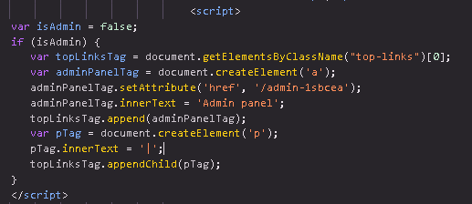
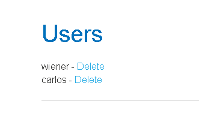

# Lab - Unprotected Admin Functionality with an Unpredictable URL

## Security by Obscurity

Some developers try to protect sensitive functionality by hiding it behind an unpredictable URL instead of enforcing proper access control. This approach is known as **Security by Obscurity**.

For example, instead of using:

```
https://example.com/admin
```

they might use:

```
https://example.com/admin-panel-yb556
```

The developer assumes that attackers won't be able to guess this URL. However, hidden URLs are **not** a security measure. They can still be discovered through:

* JavaScript files
* HTML source code
* Browser Developer Tools
* Network requests
* Public Git repositories
* Archived pages or backups

### Vulnerable Example

```javascript
var isAdmin = false;

if (isAdmin) {
    var adminPanelTag = document.createElement("a");

    adminPanelTag.setAttribute(
        "href",
        "https://example.com/admin-panel-yb556"
    );

    adminPanelTag.innerText = "Admin Panel";
}
```

Although the **Admin Panel** button is only displayed for administrators, the JavaScript file is sent to every user. Anyone can inspect the source code, discover the hidden URL and attempt to access it directly.

### Why is this insecure?

Hiding a page is **not the same as protecting it**. If the server does not verify that the user is an administrator, anyone who knows the URL may be be able to access the page.

> **Remember:** A hidden URL is not a lock. Proper server-side authorization is the real security.

---

## Lab Walkthrough

In this lab, the application contains an unprotected admin panel hosted at an unpredictable URL. Although the URL is difficult to guess, it is exposed in the application's JavaScript. The objective is to locate the admin panel, access it, and delete the user **carlos**.

First, open the browser's **Developer Tools** by pressing **F12**, then navigate to the **Sources** tab. Inspect the `index` file, where you'll find a JavaScript snippet containing the hidden admin panel URL.



Copy the admin panel URL and paste it into the browser's address bar to access the admin interface.



From the admin panel, locate the user **carlos** and click **Delete**. Once the user is deleted, the lab is successfully completed.

### Secure Approach

To prevent this vulnerability, sensitive functionality should never rely on hidden or unpredictable URLs alone. Every request to the admin panel should be validated on the **server side** to ensure that the user has the appropriate permissions. If an unauthorized user attempts to access the page, the server should return a **403 Forbidden** response instead of granting access.
