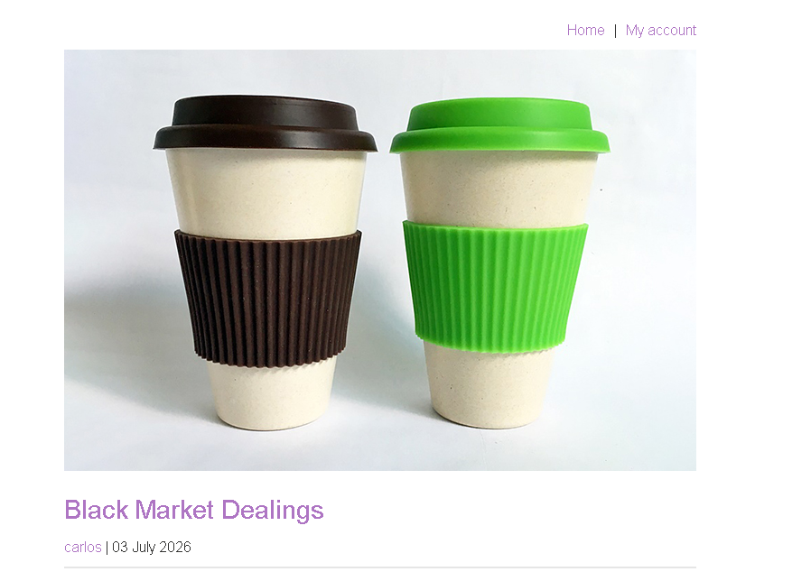
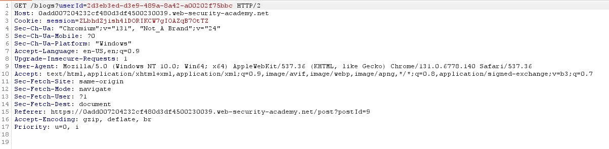
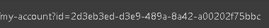
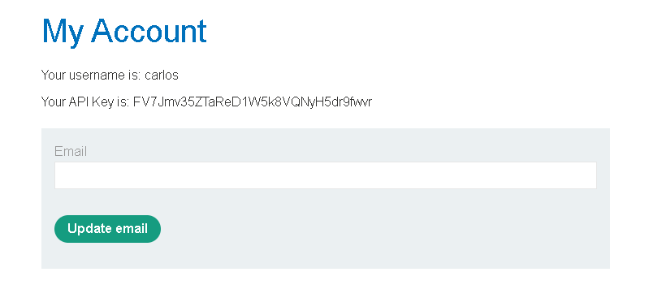

# Lab - User ID Controlled by Request Parameter, with Unpredictable User IDs

## Horizontal Privilege Escalation

Horizontal Privilege Escalation occurs when a user is able to access another user's data or perform actions on their behalf, even though both users have the **same level of privileges**.

Unlike **Vertical Privilege Escalation**, where a normal user gains administrator privileges, Horizontal Privilege Escalation happens between users with **equal permissions**.

For example, imagine two users, Alice and Bob. Both are regular users of the application.

Alice can access her account using:

```text
https://example.com/myaccount?id=123
```

If an attacker changes the URL to:

```text
https://example.com/myaccount?id=124
```

and the application displays Bob's account instead of denying access, then the application is vulnerable to **Horizontal Privilege Escalation**.

The application should always verify that the requested resource actually belongs to the currently logged-in user before granting access.

### What is IDOR?

This vulnerability is a common example of an **Insecure Direct Object Reference (IDOR)**.

An IDOR occurs when an application directly uses user-controlled values—such as IDs, filenames, or document numbers—to access resources without checking whether the user is authorized to view them.

Instead of simply trusting the supplied value, the server should verify that the resource belongs to the authenticated user.

### What if IDs are Random?

Some developers try to prevent this attack by replacing simple numeric IDs with long random identifiers called **GUIDs (Globally Unique Identifiers)**.

Instead of:

```text
?id=123
```

they may use:

```text
?id=4d62fdb1-6df4-4fd9-87d6-a0d68d1bc417
```

Since GUIDs are long and random, they are much harder to guess.

However, this **does not completely solve the problem**.

If the application exposes another user's GUID anywhere—such as in:

* User profiles
* Public reviews
* Comments
* Chat messages
* Shared documents

an attacker can simply copy that GUID and use it to access another user's resources if proper authorization checks are missing.

Random identifiers make guessing harder, but they **do not replace access control**.

### Real World Example

Imagine Hogwarts has lockers for every student.

Harry and Ron are both students, so they have the **same privileges**. Each locker has a number.

Harry's locker:

```text
Locker #101
```

Ron's locker:

```text
Locker #102
```

Harry opens his locker by telling Filch:

```text
Open locker 101.
```

Filch doesn't check whose locker it is—he simply opens whatever locker number is requested.

Harry then says:

```text
Open locker 102.
```

Filch opens Ron's locker without asking any questions.

Harry didn't become the Head Boy or a professor. He simply accessed another student's locker.

That's **Horizontal Privilege Escalation**.

Now imagine Hogwarts replaces locker numbers with magical random codes like:

```text
A9F2-7XQ8-KL91
```

This makes the lockers harder to guess.

But if Hermione accidentally posts Ron's locker code on the common room notice board, Harry can still copy it and ask Filch to open that locker.

Random codes don't solve the real problem.

The real solution is for Filch to check:

> "Does this locker actually belong to Harry?"

Only if the answer is **yes** should the locker be opened.

### Secure Approach

To prevent Horizontal Privilege Escalation:

* Never trust IDs supplied by the user.
* Always verify that the requested resource belongs to the authenticated user.
* Use server-side authorization checks for every request.
* Treat GUIDs as identifiers, **not** as security mechanisms.

> **Remember:** Random IDs make resources harder to guess, but only proper server-side authorization prevents unauthorized access.

---

## Lab Walkthrough

This lab demonstrates a **Horizontal Privilege Escalation** vulnerability where user accounts are identified using **GUIDs** instead of predictable numeric IDs.

The lab description states:

> This lab has a horizontal privilege escalation vulnerability on the user account page, but identifies users with GUIDs. To solve the lab, find the GUID for **carlos**, then submit his API key as the solution.

The following credentials are provided:

* **Username:** `wiener`
* **Password:** `peter`

We'll use **Burp Suite** to intercept requests and identify Carlos's GUID.

First, log in using the provided credentials. Once logged in, return to the **Home** page and browse through the available posts. Find a post or comment created by **carlos**, then click on his username.



Before clicking on the username, enable **Intercept** in Burp Suite. When you click **carlos**, Burp Suite captures the request, revealing Carlos's GUID in the URL.



Now copy Carlos's GUID.

Next, navigate to **My Account**. Notice that your account page also uses a GUID in the URL to identify your profile.

Before changing the GUID:


Replace your GUID with Carlos's GUID that you copied from the intercepted request.

After changing the GUID:



Press **Enter** to load the page.

Since the application only checks the GUID supplied in the request and fails to verify whether it belongs to the authenticated user, Carlos's account page is displayed instead of your own.

Among the information displayed is Carlos's API key.



Copy the API key, submit it as the solution, and the lab is successfully completed.

### Why does this work?

Although the application uses random GUIDs instead of sequential IDs, it still fails to perform proper authorization checks. Once Carlos's GUID is disclosed through his public profile, an attacker can reuse it to access his account.

This demonstrates an important lesson:

> **Random identifiers make resources harder to guess, but they do not provide security. Proper server-side authorization is what prevents Horizontal Privilege Escalation.**
