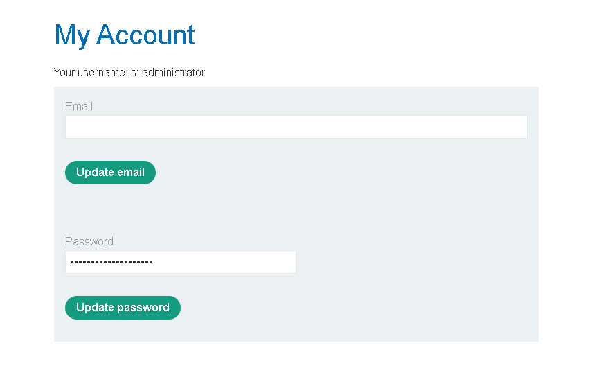
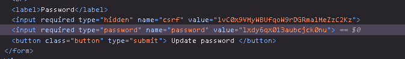
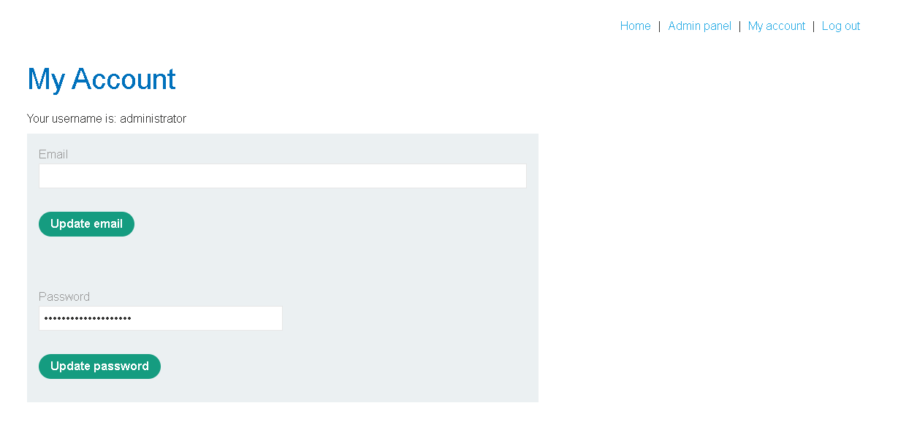

# Lab - User ID Controlled by Request Parameter with Password Disclosure

## Horizontal to Vertical Privilege Escalation

Horizontal to Vertical Privilege Escalation occurs when an attacker first gains access to **another user's account** (horizontal privilege escalation) and then uses that account to obtain **higher-level privileges**, such as administrator access (vertical privilege escalation).

In simple terms, the attacker starts by pretending to be **another user**, and if that user has more privileges, the attacker eventually becomes an **administrator**.

For example, a regular user accesses their account using:

```text
https://example.com/myaccount?id=123
```

If the attacker changes the request to:

```text
https://example.com/myaccount?id=456
```

and `id=456` belongs to an administrator, the application may display the administrator's account page if proper authorization checks are missing.

Once inside the administrator's account, the attacker may be able to:

* View sensitive information.
* Reset or change the administrator's password.
* Access the admin panel.
* Perform administrative actions.
* Take complete control of the application.

This attack combines **Horizontal Privilege Escalation** with **Vertical Privilege Escalation**, making it much more dangerous than either attack on its own.

### How does it happen?

A typical attack follows these steps:

1. A normal user accesses another user's account by modifying a user-controlled parameter.
2. The attacker discovers that the target account belongs to an administrator.
3. The attacker uses the administrator's account to gain elevated privileges.
4. Administrative functionality becomes available to the attacker.

### Real World Example

Imagine Hogwarts has magical student ID cards.

Harry is allowed to enter the **Gryffindor Common Room**, but nowhere else.

One day, Harry finds a way to change the ID number on his card.

Instead of using:

```text
Student ID = Harry
```

he changes it to:

```text
Student ID = Percy Weasley
```

At first, this is only **Horizontal Privilege Escalation** because Percy is also a student.

Now Harry changes the ID again, but this time he uses:

```text
Student ID = Professor McGonagall
```

The castle doors believe he is Professor McGonagall.

Suddenly Harry can:

* Enter the Headmaster's Office.
* Access restricted classrooms.
* Read confidential records.
* Change school rules.
* Award or remove House Points.

Harry didn't magically become a professor.

He simply tricked the castle into believing he was one.

This is **Horizontal to Vertical Privilege Escalation**.

### Why is this dangerous?

The attacker doesn't need to hack administrator passwords or exploit complicated vulnerabilities.

Instead, they simply gain access to an administrator's account because the application fails to verify whether the requested account actually belongs to the logged-in user.

Once the administrator's account is compromised, every administrator privilege becomes available to the attacker.

### Secure Approach

Applications should never trust user-supplied identifiers when deciding which account to display.

Every request should be verified on the server to ensure that:

* The requested account belongs to the authenticated user.
* Sensitive actions require proper authorization.
* Users cannot access or modify another user's data simply by changing request parameters.

Even if an attacker knows an administrator's user ID or GUID, the server should deny access unless the authenticated user is actually that administrator.

> **Remember:** A Horizontal Privilege Escalation can become a Vertical Privilege Escalation if the compromised account belongs to a more privileged user. Always enforce authorization on the server—not in user-controlled parameters.

---

## Lab Walkthrough

The lab description states:

> This lab has a user account page that contains the current user's existing password, prefilled in a masked input. To solve the lab, retrieve the administrator's password, then use it to delete the user **carlos**.

The following credentials are provided:

* **Username:** `wiener`
* **Password:** `peter`

The goal is to access the administrator's account page, reveal the stored password, log in as the administrator, and delete the user **carlos**.

### Step 1 - Log in

After opening the lab, navigate to **My Account** and log in using the provided credentials.

Once logged in, notice that the URL contains your username (`wiener`), which is being used to identify which account page is displayed.


---

### Step 2 - Change the Username in the URL

Since the application trusts the value supplied in the URL, simply replace:

```text
wiener
```

with:

```text
administrator
```

The URL now looks like this:


Press **Enter** to load the page.

If the application does not verify ownership of the requested account, it will display the administrator's account page.

---

### Step 3 - Reveal the Administrator Password

The administrator's password is already filled into the password field, but it is hidden behind dots.



To reveal it, press **F12** to open the browser's **Developer Tools**.

Use the **Inspect Element** tool and click on the password field. The HTML source contains the actual value of the password inside the input element.



Copy the password.

---

### Step 4 - Log in as the Administrator

Log out of the current account and sign in using:

* **Username:** `administrator`
* **Password:** *(the password you just copied)*

After successfully logging in, the **Admin Panel** becomes available.



Open the **Admin Panel**, locate the user **carlos**, and click **Delete**.

Once Carlos has been deleted, the lab is successfully completed.

---

### Why does this work?

This application is vulnerable because it allows users to choose which account page to access simply by modifying the username in the URL.

Even worse, the administrator's password is already present in the page's HTML and is merely hidden by the password field. Anyone who can access the page can reveal the password using the browser's Developer Tools.

This vulnerability demonstrates how a **Horizontal Privilege Escalation** (accessing another user's account) can quickly become a **Vertical Privilege Escalation** when the compromised account belongs to an administrator.

### Key Takeaway

Changing a value in the URL should **never** be enough to access another user's account. Every request must be validated on the server to ensure that the authenticated user is authorized to access the requested resource. Sensitive information, such as passwords, should also never be exposed in the page source, even if it appears masked on the screen.
