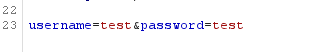
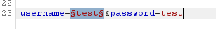
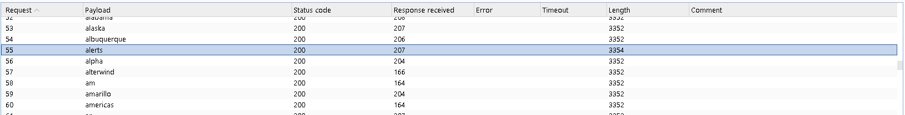
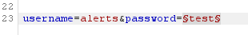
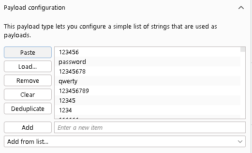
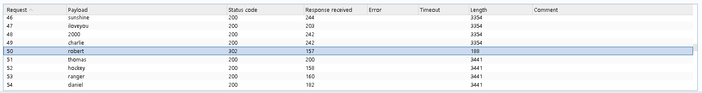

# Authentication Vulnerabilities
### A Beginner-Friendly Guide (with Harry Potter Examples) + Hands-On Lab Walkthrough

This repo covers authentication vulnerabilities from two angles:

- **Part 1** builds the mental model — what authentication vulnerabilities are, why they matter, and the core attack types — using Hogwarts as a running analogy.
- **Part 2** applies that model to a real, hands-on lab: enumerating a valid username and brute-forcing its password using Burp Suite Intruder.

If you're new to web security, read Part 1 first. If you already know the theory and just want the walkthrough, jump to [Part 2](#part-2--hands-on-lab-username-enumeration-via-different-responses).

---

## Table of Contents

**Part 1 — Concepts**
1. [What are Authentication Vulnerabilities?](#1-what-are-authentication-vulnerabilities)
2. [Authentication vs Authorization](#2-authentication-vs-authorization)
3. [Why Authentication Vulnerabilities are Dangerous](#3-why-authentication-vulnerabilities-are-dangerous)
4. [Brute Force Attacks](#4-brute-force-attacks)
5. [Brute Forcing Usernames](#5-brute-forcing-usernames)
6. [Brute Forcing Passwords](#6-brute-forcing-passwords)
7. [Password Policies](#7-password-policies)
8. [Human Weakness in Password Creation](#8-human-weakness-in-password-creation)
9. [Username Enumeration](#9-username-enumeration)
10. [Password Reset Poisoning](#10-password-reset-poisoning)
11. [Quick Revision](#11-quick-revision)

**Part 2 — Hands-On Lab**

12. [Tools of the Trade: Burp Suite Intruder](#12-tools-of-the-trade-burp-suite-intruder)
13. [Lab Walkthrough: Username Enumeration via Different Responses](#13-lab-walkthrough-username-enumeration-via-different-responses)
14. [Key Takeaways & Defensive Recommendations](#14-key-takeaways--defensive-recommendations)

---

# Part 1 — Concepts

## 1. What are Authentication Vulnerabilities?

Authentication vulnerabilities are weaknesses in the login or identity-verification process of an application. Instead of breaking through complicated code, an attacker simply **tricks or bypasses the process that proves who they are.**

Think of authentication as the security guard standing at the entrance of a building. If the guard lets the wrong person inside, every locked room behind them becomes useless — the rest of the building's security was never tested.

**Harry Potter Example**

Before entering the Gryffindor Common Room, the Fat Lady asks for the password:

> "Fortuna Major"

She opens the door. Say the wrong password, and she refuses entry. Now imagine she accidentally opens the door whenever someone simply says *"I'm Harry Potter."* That's an authentication vulnerability — the attacker didn't defeat magic, they fooled the system that was supposed to check identity.

---

## 2. Why Authentication Vulnerabilities are Dangerous

Authentication is the front door of every application. If attackers bypass it, they can:

- Read private information
- Modify or delete data
- Steal money
- Become administrators
- Perform actions as another user

Instead of attacking every page individually, attackers just steal the keys.

**Harry Potter Example**

Instead of fighting every professor, Draco steals Harry's Hogwarts ID card. Now every door that recognizes "Harry Potter" opens for Draco. The security failed at the very first checkpoint, so nothing downstream mattered.

---

## 3. Authentication vs Authorization

These two terms are often confused, but they answer completely different questions.

| | Question it answers | Example |
|---|---|---|
| **Authentication** | *Who are you?* | Username + password, fingerprint, OTP, security key |
| **Authorization** | *What are you allowed to do?* | Once logged in, which files/pages/actions can you access? |

**Harry Potter Example**

The Fat Lady asking "What's today's password?" and confirming Harry may enter — that's **authentication**. Harry being allowed into Gryffindor Tower but *not* the Slytherin dormitory — even though he's a fully authenticated student — is **authorization**. Neville is authenticated the moment he proves he's Neville; he's simply never authorized to enter Slytherin.

**Real-world version:** Logging into Gmail (entering email, password, OTP) is authentication. Once inside, being able to read *your own* emails but not Elon Musk's is authorization. A bug in the first system lets a stranger log in as you. A bug in the second lets *you*, once logged in, see things you shouldn't.

---

## 4. Brute Force Attacks

A brute force attack is simply guessing credentials repeatedly until one works. Instead of guessing once, an attacker might try 100, 1,000, or millions of combinations — almost always automated with software rather than typed by hand.

**Real-world example:** Imagine trying every possible combination on a 4-digit suitcase lock — 0000, 0001, 0002... eventually one is correct. A login form works the same way, just with more possible values.

**Harry Potter Example**

Draco tries "Open," "Alohomora," "Gryffindor," "Hogwarts" against the Fat Lady — all rejected — until "Fortuna Major" finally opens the door. That trial-and-error process *is* brute forcing.

**Why automation makes it dangerous:** A human might try 20 passwords in an evening out of patience. A script can try hundreds or thousands per second. Without rate-limiting, account lockouts, or CAPTCHAs, weak credentials fall almost immediately.

---

## 5. Brute Forcing Usernames

Before guessing a password, an attacker often needs a valid username to target. Finding usernames is usually far easier than finding passwords, because organizations tend to use predictable formats:

```
firstname.lastname
admin / administrator
support / helpdesk / it
```

**Real-world example:** If a school's emails all follow `firstname.lastname@school.edu`, then knowing a student is named Harry Potter instantly tells you their likely username is `harry.potter@hogwarts.edu` — no guessing required, only the password remains unknown.

---

## 6. Brute Forcing Passwords

Once a valid username is known, the attacker moves on to guessing the password. This is where weak, common passwords become a serious liability — lists of the most-reused passwords in the world (`password`, `123456`, `qwerty`, `football`, etc.) are public and get tried first in almost every automated attack.

**Harry Potter Example**

If Harry's password were something like `hedwig`, `gryffindor`, or `quidditch`, an attacker who knows anything about him would try those *before* anything random — because personal details (pets, houses, hobbies) are exactly what humans fall back on when choosing passwords.

---

## 7. Password Policies

To fight this, many sites enforce rules such as:

- Minimum 8+ characters
- At least one uppercase and one lowercase letter
- At least one number and one special symbol

A password like `Y9@kP!3Qz$` is dramatically harder to brute-force than `harry`, simply because the space of possible combinations explodes with length and character variety.

---

## 8. Human Weakness in Password Creation

Policies push people toward *complexity*, but humans optimize for *memorability* — so they usually make the smallest possible tweak that satisfies the rule, not a genuinely random password.

**Example:** `mypassword` gets rejected → user changes it to `Mypassword1!`. Still trivially guessable once you know the pattern. Forced 90-day password rotations produce the same problem: `Winter2025!` becomes `Winter2026!` next quarter.

**Harry Potter Example**

Harry uses `Hedwig1!`, then `Hedwig2!`, then `Hedwig3!` after each forced change. Draco doesn't need to brute-force from scratch — he just needs to notice the pattern once.

---

## 9. Username Enumeration

**Definition:** Username enumeration happens when a website accidentally reveals *whether a given username exists*, even without confirming the password.

**Example:** Suppose a login form's error messages are too specific:

- Type `harry` + wrong password → **"Incorrect password"** → confirms `harry` is a real account
- Type `snape` + wrong password → **"Invalid username"** → confirms `snape` does *not* exist

That asymmetry lets an attacker silently build a list of confirmed real accounts before ever attempting a single password guess — turning a two-unknown problem (valid username *and* valid password) into a one-unknown problem.

**Secure response:** A well-built login form always replies with a single, generic message regardless of which part was wrong:

```
Invalid username or password.
```

**Harry Potter Example**

Draco asks the Fat Lady, "Is Harry in Gryffindor?" She replies, "Yes, wrong password" — and now Draco knows Harry exists, without ever having entered a real password. A better-trained Fat Lady would simply say, "I cannot tell you whether the name or the password is wrong."

---

## 10. Password Reset Poisoning

**Definition:** Many sites let users reset forgotten passwords via an emailed link. If the application builds that link using attacker-controllable input (most commonly the HTTP `Host` header) without validating it, an attacker can manipulate the server into generating a reset link that points to *their* domain instead of the real one.

**Simplified flow:**

```
Normal:   User requests reset → email contains https://example.com/reset?token=ABC123
Attacked: Attacker manipulates the request → email contains https://evil.com/reset?token=ABC123
```

If the victim clicks that poisoned link, the token lands in the attacker's hands, and it can be replayed against the real site to take over the account — all without the victim ever "giving away" their password directly.

**Harry Potter Example**

Harry forgets his Gringotts vault password. Normally, Gringotts sends Hedwig with a secure reset token. Draco secretly redirects the owl so it delivers the letter to *him* instead. Draco reads the token, resets Harry's vault password, and now controls the vault — the reset *mechanism* was abused, not Harry's judgment.

---

## 11. Quick Revision

| Concept | Easy Meaning |
|---|---|
| Authentication | Proving who you are |
| Authorization | What you're allowed to do once identified |
| Brute Force | Guessing credentials repeatedly |
| Username Enumeration | Site reveals whether a username exists |
| Password Brute Force | Guessing passwords for a known username |
| Password Policy | Rules meant to force stronger passwords |
| Password Reset Poisoning | Manipulating reset links to steal reset tokens |

**Hogwarts-as-a-website recap:**

- Fat Lady = Authentication system
- Dumbledore = Administrator
- Password = Login credentials
- Dormitory access = Authorization
- Draco guessing passwords = Brute force
- "Yes, wrong password" = Username enumeration leak
- Redirected Hedwig = Password reset poisoning

If the castle's front door is weak, every protection spell inside the building becomes far less effective — which is exactly why authentication is treated as the highest-priority layer to secure.

---

# Part 2 — Hands-On Lab: Username Enumeration via Different Responses

Theory is only half the picture. This section walks through actually exploiting weak authentication on a real (legal, sandboxed) target: a **PortSwigger Web Security Academy** lab built specifically to teach this exact vulnerability class.

## 12. Tools of the Trade: Burp Suite Intruder

The lab uses **Burp Suite**, the standard tool for manual and semi-automated web app testing. Two pieces matter here:

- **Proxy/Intercept** — sits between your browser and the target site, letting you capture and inspect the raw HTTP request before it's sent (so you can see exactly which parameters carry the username and password).
- **Intruder** — takes a captured request, lets you mark one or more parts of it as a "payload position," and then automatically re-sends the request once per value in a wordlist, cycling through it for you instead of typing each guess by hand.

Intruder offers four attack types, and picking the right one matters:

| Attack type | What it does | When to use it |
|---|---|---|
| **Sniper** | One payload set, cycled through one position at a time | Testing a single parameter (e.g., just the username) while everything else stays fixed — what this lab uses |
| Battering ram | Same single payload inserted into *all* positions simultaneously | When multiple fields must change to the same value together |
| Pitchfork | Multiple payload sets, moved in parallel (position 1 pairs with position 2, index-by-index) | When you have matched pairs, e.g. username[i] with password[i] |
| Cluster bomb | Multiple payload sets, tried in every combination | Brute-forcing username *and* password together with no known pairing |

This lab uses **Sniper** twice, in two separate phases — once to enumerate usernames, once (with the confirmed username locked in) to brute-force the password. That two-phase approach is exactly what Part 1's "Username Enumeration" section described: attackers rarely guess username and password simultaneously, because it's far more efficient to confirm the username first.

## 13. Lab Walkthrough: Username Enumeration via Different Responses

**Given by the lab:** a login page with predictable credentials, plus full candidate lists for both usernames and passwords (see below). The goal: find the one valid username, brute-force its password, and log in.

### Step 1 — Capture a baseline login request

Open the lab's login page, enter a throwaway value in both fields (e.g. `test` / `test`), and submit it **with Burp's Intercept turned on** so the raw POST request is captured before it reaches the server.


This confirms the exact structure of the request — which parameter is `username`, which is `password`, and what the request looks like in full.



### Step 2 — Send to Intruder and mark the username as the payload position

Right-click the intercepted request → *Send to Intruder*. In the Positions tab, clear the auto-suggested markers and place a single payload marker around the `username` value only — leave `password` as a fixed placeholder for now, since this phase is only trying to find out *which usernames exist*, not which passwords work.



### Step 3 — Load the username wordlist, attack type: Sniper

With **Sniper** selected as the attack type (see the table above — we're only varying one position), go to the Payloads tab, keep "Simple list" as the payload type, and paste in the full candidate username list the lab provides.


<details>
<summary>Candidate usernames (click to expand)</summary>

```
carlos, root, admin, test, guest, info, adm, mysql, user, administrator,
oracle, ftp, pi, puppet, ansible, ec2-user, vagrant, azureuser, academico,
acceso, access, accounting, accounts, acid, activestat, ad, adam, adkit,
admin, administracion, administrador, administrator, administrators, admins,
ads, adserver, adsl, ae, af, affiliate, affiliates, afiliados, ag, agenda,
agent, ai, aix, ajax, ak, akamai, al, alabama, alaska, albuquerque, alerts,
alpha, alterwind, am, amarillo, americas, an, anaheim, analyzer, announce,
announcements, antivirus, ao, ap, apache, apollo, app, app01, app1, apple,
application, applications, apps, appserver, aq, ar, archie, arcsight,
argentina, arizona, arkansas, arlington, as, as400, asia, asterix, at,
athena, atlanta, atlas, att, au, auction, austin, auth, auto, autodiscover
```
</details>

### Step 4 — Run the attack and look for the outlier response length

Start the attack and let it work through every candidate. Burp shows the **response length** (and status code) for each attempt in a results table. Almost every wrong username produces an *identical* response length, because the server sends back the same generic error page. The one username that behaves even slightly differently — a few bytes longer or shorter, because the underlying error message text changes even if it *looks* the same on screen — is your signal.

In this run, that outlier was **`alerts`**.



This is exactly the "subtly different response" from the lab's name in action: the developers likely intended both error paths to look identical to a human reading the page, but the raw HTTP response bodies differ by a small, measurable amount — which is invisible to a person eyeballing the page, but very visible when Burp lines up every response side-by-side.

*(You can sanity-check this manually too: go to the login page, type any other username → you'll see "Invalid username." Type `alerts` → you'll see "Incorrect password" instead. That message-level difference is the same signal, just visible without Burp.)*

### Step 5 — Switch the payload position to the password field

Back in Intruder, remove the payload marker from `username` and hard-code it to `alerts` (the confirmed valid account). Add a new payload marker around `password` instead. Attack type stays **Sniper** — same logic as before, just one moving part.



Load the candidate password list into the Payloads tab:



<details>
<summary>Candidate passwords (click to expand)</summary>

```
123456, password, 12345678, qwerty, 123456789, 12345, 1234, 111111,
1234567, dragon, 123123, baseball, abc123, football, monkey, letmein,
shadow, master, 666666, qwertyuiop, 123321, mustang, 1234567890, michael,
654321, superman, 1qaz2wsx, 7777777, 121212, 000000, qazwsx, 123qwe,
killer, trustno1, jordan, jennifer, zxcvbnm, asdfgh, hunter, buster,
soccer, harley, batman, andrew, tigger, sunshine, iloveyou, 2000, charlie,
robert, thomas, hockey, ranger, daniel, starwars, klaster, 112233, george,
computer, michelle, jessica, pepper, 1111, zxcvbn, 555555, 11111111,
131313, freedom, 777777, pass, maggie,159753, aaaaaa, ginger, princess,
joshua, cheese, amanda, summer, love, ashley, nicole, chelsea, biteme,
matthew, access, yankees, 987654321, dallas, austin, thunder, taylor,
matrix, mobilemail, mom, monitor, monitoring, montana, moon, moscow
```
</details>

### Step 6 — Run the attack and spot the correct password

Same signal as before: nearly every attempt returns an identically-sized "incorrect password" response, except the one attempt where the password is actually correct — that response is longer or shorter (typically because it redirects to the account page instead of re-rendering the login form with an error).



### Step 7 — Log in

With both a confirmed username and confirmed password in hand, submit them through the normal login form. Lab solved.

**In Potter terms:** Phase 1 was Draco asking the Fat Lady about every name in the school register until one produced "wrong password" instead of "you don't exist" — confirming Harry (`alerts`) is real. Phase 2 was Draco then trying every password he could think of against that one confirmed name, until the door finally opened.

## 14. Key Takeaways & Defensive Recommendations

What this lab demonstrates in practice, mapped back to Part 1's concepts:

- **Predictable usernames + weak passwords are a compounding weakness.** Neither flaw alone is catastrophic; together, they turn a login form into a two-step guessing game that automation solves in minutes.
- **Username enumeration is often invisible to the eye but visible to a diff.** Two error messages that *read* the same to a human can still differ by a byte or two in the raw HTTP response — which is all an automated attack needs.
- **Fix:** always return one identical, generic error for both "wrong username" and "wrong password," and make sure the response length, timing, and status code are indistinguishable too — not just the visible text.
- **Fix:** rate-limit or lock out repeated failed logins, and require increasingly strong friction (CAPTCHA, delays, alerts) after a handful of failures, so Intruder-style automation stops being viable long before a wordlist runs out.
- **Fix:** enforce real password policies *and* screen new passwords against known-breached password lists (like the "candidate passwords" list above) — most of the entries in that list are exactly what large-scale password dumps are full of.
- **Fix for password reset specifically:** never trust the `Host` header (or any client-controlled value) when building a reset link server-side; use a fixed, server-configured domain instead.

---

**References / further reading:** PortSwigger Web Security Academy — Authentication topic (the source of the lab used in Part 2).
