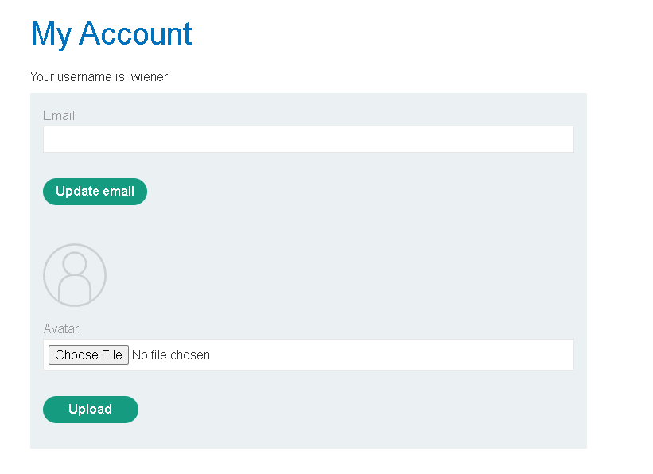
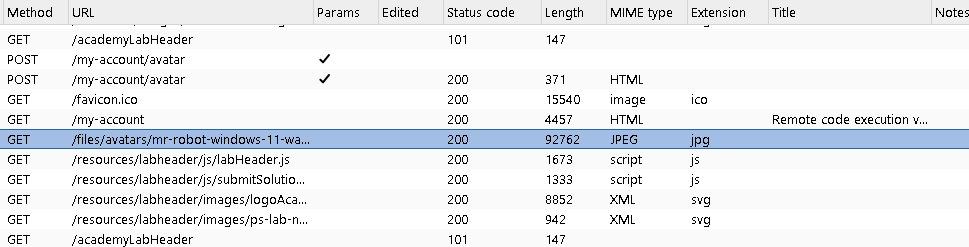
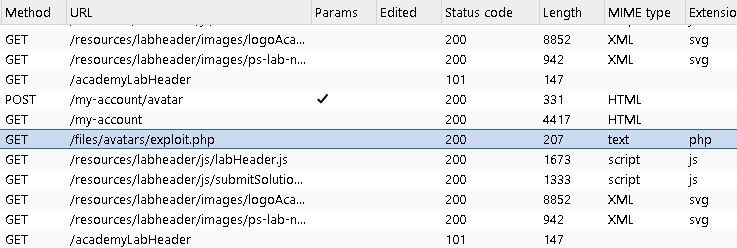
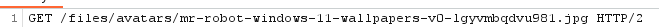
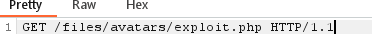

# File Upload Vulnerabilities

## What Are They?

A file upload vulnerability exists when a web application lets users upload files but doesn't properly check what those files actually are before storing or serving them. On the surface this looks like a routine feature — a profile picture uploader, a document attachment form, a CV submission box — but if the server trusts the file's name, extension, declared content type, or size without truly verifying them, an attacker can slip in something the application never intended to accept.

The danger scales with what the server does with the file afterward. At the low end, a missing size check can let someone fill up disk space. At the high end, if the server can be tricked into treating an uploaded file as executable code — a PHP, JSP, or Python script, for instance — the attacker can gain the ability to run arbitrary commands on the machine. Some attacks do damage the moment the file lands (e.g., a malicious file overwriting something sensitive); others require a follow-up request to the uploaded file's URL to trigger execution.

## How Do These Flaws Happen?

Very few applications accept uploads with zero restrictions — that would be an obvious red flag even to inexperienced developers. The real problem is usually validation that *looks* solid but has gaps:

- **Blocklists instead of allowlists.** Rejecting known-dangerous extensions (`.php`, `.exe`, etc.) instead of only permitting known-safe ones. Blocklists are inherently incomplete — there are dozens of executable extensions a server might run (`.php5`, `.phtml`, `.shtml`, and so on), and it's easy to miss one.
- **Trusting client-supplied metadata.** Checking the `Content-Type` header or the file extension the browser sends, both of which an attacker can freely rewrite using an intercepting proxy before the request ever reaches the server.
- **Extension parsing quirks.** Servers and filesystems don't always agree on what "the extension" of a filename is. A file named `shell.php.jpg` or `shell.pHp` might be classified as an image by the validation logic but still get executed as PHP by the web server, depending on its configuration.
- **Inconsistent enforcement.** Large applications often run across multiple servers, frameworks, or storage locations, and strict validation applied in one place may quietly not apply in another — leaving a gap an attacker can find.

## The Worst Case: Deploying a Web Shell

The most severe outcome is when an application accepts a server-side script and the web server is configured to execute files in that upload directory. If those two conditions line up, an attacker can upload their own **web shell** — a small script that lets them run commands on the server just by making HTTP requests to it.

Once a web shell is in place, the attacker effectively controls the server: reading and writing files, pulling out sensitive data, and potentially using the compromised machine as a launchpad for further attacks against other internal or external systems.

A minimal example — a script that simply reads out the contents of any file on disk:

```php
<?php echo file_get_contents('/path/to/target/file'); ?>
```

A more dangerous variant lets the attacker run any operating system command via a URL parameter:

```php
<?php echo system($_GET['command']); ?>
```

With this uploaded and reachable, the attacker passes whatever command they want to run through the `command` query parameter:

```
GET /uploads/shell.php?command=whoami HTTP/1.1
```

The server executes that command and echoes the result back in the HTTP response. This is the canonical, textbook illustration of the risk — it's why "can an uploaded file be executed by the server" is one of the first questions a security review of an upload feature should answer.

## Real-World Example: CVE-2020-25213 (WordPress File Manager Plugin)

A concrete case that shows how quickly this class of bug gets weaponized at scale is **CVE-2020-25213**, discovered in the popular WordPress plugin *File Manager* (`wp-file-manager`) in September 2020.

**What went wrong:** the plugin bundled a third-party library called elFinder to provide its file-browsing UI. elFinder ships with an example "connector" script meant only as a demo, normally saved with a `.dist` extension so it can't run. File Manager's install process renamed that file to `connector.minimal.php` — making it a live, executable PHP endpoint — without adding any authentication or authorization checks. Anyone on the internet could send a request straight to that file and use elFinder's built-in commands (`upload`, `mkfile`, `put`) to write arbitrary PHP files into the plugin's directory on the server.

**Impact:** the plugin had roughly 700,000 active installations at the time. Because the flaw required no login at all, it was trivial to automate, and mass exploitation began within roughly 24 hours of the vulnerability becoming public. Security researchers observed attackers using the bug to drop web shells, which were then used to install further malware — including, in cases documented by Palo Alto Networks, a cryptomining payload from the "Kinsing" malware family, turning compromised WordPress servers into cryptojacking bots.

**Why it matters as a case study:** it demonstrates several of the "how these arise" points at once — a file that should never have been web-accessible was exposed by an installation script, no allowlist or authentication guarded the upload path, and the gap between "intended behavior" and "actual server configuration" was invisible until someone went looking for it. It also shows how fast these bugs get exploited once found: a single unauthenticated upload endpoint was enough to compromise hundreds of thousands of sites.

## Hands-On Practice: PortSwigger Lab — "Remote Code Execution via Web Shell Upload"

Reading about a vulnerability only gets you so far — this concept clicks a lot faster once you've triggered it yourself in a safe, disposable environment. PortSwigger's Web Security Academy provides a free lab built for exactly this: **[Remote code execution via web shell upload](https://portswigger.net/web-security/file-upload/lab-file-upload-remote-code-execution-via-web-shell-upload)** (Apprentice difficulty). Each time you launch it, PortSwigger spins up a private, temporary instance just for your account, so there's no real victim and nothing outside that instance is affected.

**The setup:** the lab is a simple blog site with an account page that lets you upload an avatar image. That upload feature performs *no* validation at all — not on the extension, not on the content type, not on the file's actual contents. Your goal is to prove that by uploading a PHP web shell and using it to read a file that shouldn't be publicly accessible: `/home/carlos/secret`. You're given a working login (`wiener` / `peter`) so you can focus entirely on the upload flaw rather than on getting into the account in the first place.

Here's the walkthrough in more detail, with the reasoning behind each step:

**1. Log in and find the upload feature.**
With Burp Suite running as your intercepting proxy (so every request your browser makes passes through it and gets logged), log into "My Account" with the credentials above. On that page there's a section for uploading a profile picture.



**2. Upload an ordinary image first — deliberately, before trying anything malicious.**
Pick any harmless image and upload it. This step isn't the attack itself; it's reconnaissance. It tells you two things you'll need later: that the upload *works at all*, and — more importantly — *where the server puts uploaded files and how it names the URL to fetch them back*. You'll see a confirmation message like:

> The file `avatars/mr-robot-windows-11-wallpapers-v0-lgyvmbqdvu981.jpg` has been uploaded.
> ← Back to My Account

**3. Find the image's request in Burp's HTTP history.**
Click "Back to My Account" — this makes the browser actually re-request the avatar to display it, which is what puts a matching request in Burp's logs. Open **Proxy → HTTP History** in Burp Suite; this tab is simply a running log of every request/response pair your browser has sent through the proxy. Look for the `GET` request for your image — it will look like `GET /files/avatars/<your-filename>` — and use the filter bar at the top if the list is long.



**4. Send that request to Repeater.**
Right-click the request and choose **Send to Repeater**. Repeater is the Burp Suite tool for taking one specific request and firing it off again — with edits, if you want — without re-doing the whole login/upload workflow in the browser each time. You're setting this up now purely so that later, you can just change one filename and hit "Send" again, instead of repeating every step from scratch.

**5. Write the actual web shell.**
On your own machine, create a file called `exploit.php` (any name works, since nothing checks it) containing:

```php
<?php echo file_get_contents('/home/carlos/secret'); ?>
```

There's nothing hidden here: `file_get_contents()` is a built-in PHP function that opens a file and returns its contents as text, and `echo` prints that text out. If — and only if — the server ever *executes* this file rather than just serving it as a static download, the response will contain whatever is inside `/home/carlos/secret`.

**6. Upload `exploit.php` through the exact same avatar upload form.**
Because the lab performs no validation whatsoever, the server accepts the `.php` file exactly as happily as it accepted the `.jpg` earlier. You'll get the same "file has been uploaded" message, just pointing at `avatars/exploit.php` this time.



**7. Confirm it landed, using HTTP history again.**
Go back to "My Account" once more (so the request gets logged) and check **Proxy → HTTP History**. You should now see a `GET /files/avatars/exploit.php` request — proof the file genuinely exists at that path on the server, not just that the upload form said "success."

**8. Go back to Repeater and change the filename in the request.**
Switch to the Repeater tab holding your original image request and edit the request line itself — change nothing except the path, swapping the image filename for the PHP file's filename:

Before:
```
GET /files/avatars/mr-robot-windows-11-wallpapers-v0-lgyvmbqdvu981.jpg HTTP/2
```



After:
```
GET /files/avatars/exploit.php HTTP/1.1
```



This is the crucial move: you're not uploading anything new here, and you're not doing anything the browser couldn't do on its own by visiting the URL directly. You're simply asking the server for the PHP file the same way you'd ask for any other uploaded file — the only thing that's different is what's *inside* the file this time.

**9. Send it, and read the output.**
Click **Send**. Because the `/files/avatars/` directory is (mis)configured to *execute* PHP files rather than just hand them back as raw text, the server runs your script instead of downloading it. `file_get_contents('/home/carlos/secret')` executes server-side, and the response body that comes back now contains Carlos's secret value instead of PHP source code.

**10. Submit the secret.**
Copy that value out of the response and paste it into the "Submit solution" button in the lab banner. The lab specifically wants the *secret's contents*, not just a successful upload — that's how it verifies you actually achieved code execution, not merely a file upload.

**Tying it back to the concepts above:** steps 1–4 are all about learning the URL pattern the server uses to serve uploads (the reconnaissance any attacker needs to do first); step 5 is the actual payload, and — as the earlier section shows — it can be a single line of PHP; step 6 succeeds only because the upload form has none of the allowlisting or content checks described in "How Do These Flaws Happen?"; and steps 8–9 are the "follow-up request" mentioned at the very top of this document — uploading the file alone does nothing until something requests it and the server chooses to execute rather than just serve it.

## Defending Against File Upload Vulnerabilities

- **Allowlist file types**, don't blocklist them — and validate the file's actual content (e.g., checking magic bytes/signatures), not just its name or declared MIME type.
- **Never execute uploaded files.** Store uploads outside the webroot, or in a directory explicitly configured to never execute scripts, and serve them through a handler that sets a safe `Content-Disposition` and content type.
- **Rename uploads** to a randomly generated name so an attacker can't control the path or extension the file is ultimately saved with.
- **Enforce size limits** and scan file contents where feasible (e.g., re-encoding images rather than trusting the original bytes).
- **Apply validation consistently** across every service, host, and framework that touches the upload — a rule enforced in one place and skipped in another is effectively not enforced at all.
- **Keep third-party components (plugins, libraries) patched and audited** — as CVE-2020-25213 shows, the vulnerable code doesn't have to be something you wrote yourself.

## References

- NVD entry: [CVE-2020-25213](https://nvd.nist.gov/vuln/detail/CVE-2020-25213)
- Wordfence: ["700,000 WordPress Users Affected by Zero-Day Vulnerability in File Manager Plugin"](https://www.wordfence.com/blog/2020/09/700000-wordpress-users-affected-by-zero-day-vulnerability-in-file-manager-plugin/)
- Unit 42 (Palo Alto Networks): ["Exploits in the Wild for WordPress File Manager RCE Vulnerability (CVE-2020-25213)"](https://unit42.paloaltonetworks.com/cve-2020-25213/)
- OWASP: [Unrestricted File Upload](https://owasp.org/www-community/vulnerabilities/Unrestricted_File_Upload)
- PortSwigger Web Security Academy: [Lab — Remote code execution via web shell upload](https://portswigger.net/web-security/file-upload/lab-file-upload-remote-code-execution-via-web-shell-upload)
