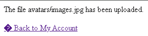
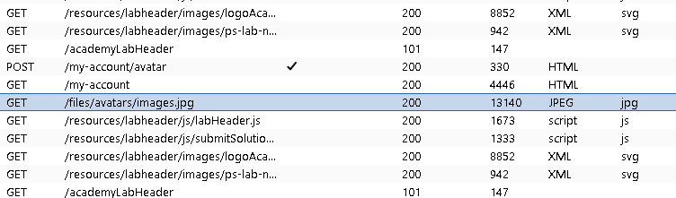
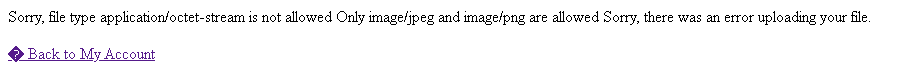
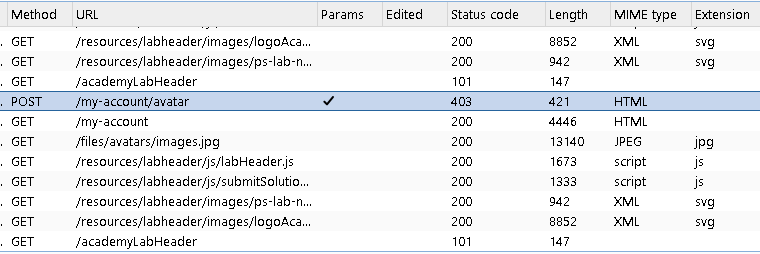
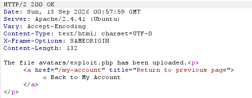

# File Upload Vulnerabilities: Bypassing Flawed Content-Type Validation

*Theory, and a full hands-on walkthrough of the PortSwigger Web Security Academy lab "Web shell upload via Content-Type restriction bypass."*

---

## Part 1 — Understanding the Vulnerability

### 1.1 Overview

File upload features are everywhere — profile pictures, resumes, PDF invoices, CSV imports. Every one of them is also a potential doorway for an attacker to hand the server a file it never should have accepted. If that file is a script the server is willing to execute, the attacker doesn't just get to store data on the server — they get to run their own code on it. That's a **web shell**, and it's one of the most direct routes to full remote code execution (RCE) in a web application.

Most production applications *do* have some kind of upload validation in place. The problem is that a lot of these checks validate the wrong thing, or validate the right thing in the wrong way — they check what the client *claims* about the file rather than what the file actually *is*. This document walks through one of the most common versions of that mistake: trusting the `Content-Type` value the browser (or an attacker) attaches to an uploaded file — and then puts the theory into practice against a real, intentionally vulnerable lab.

### 1.2 How a File Upload Actually Travels Over HTTP

Simple form fields (a name, an email address) are usually sent with the content type `application/x-www-form-urlencoded` — just key/value pairs squashed into the request body. That encoding is inefficient for binary data like images or documents, so browsers switch to `multipart/form-data` instead, which splits the body into distinct "parts," one per form field, separated by a boundary string.

A request uploading an avatar image alongside a text field looks roughly like this:

```
POST /account/avatar HTTP/1.1
Host: example.com
Content-Length: 51204
Content-Type: multipart/form-data; boundary=----BoundaryXYZ

------BoundaryXYZ
Content-Disposition: form-data; name="avatar"; filename="me.jpg"
Content-Type: image/jpeg

[...raw JPEG bytes...]
------BoundaryXYZ
Content-Disposition: form-data; name="displayName"

wiener
------BoundaryXYZ--
```

A few things worth breaking down, since they matter for the vulnerability:

- **The boundary** is an arbitrary delimiter string the client picks (deliberately unlikely to appear inside the actual file data) and declares in the top-level `Content-Type` header. The server uses it to know where one part ends and the next begins.
- **`Content-Disposition`** identifies which form field a part belongs to (`name="avatar"`) and, for file fields, the filename the client says the file has.
- **The per-part `Content-Type`** (`image/jpeg` above) is the client telling the server what kind of data is inside *this specific part*. This is the header the rest of this document is about.

The critical thing to internalize: **every one of these values is just text the client typed into the request.** Nothing about `multipart/form-data` forces the filename to be real, the declared MIME type to match the actual bytes, or the bytes themselves to be a valid image at all. A browser fills these in faithfully when a real user uploads a real file through a real form — but nothing stops someone using a proxy tool like Burp Suite from sending a request that claims one thing while containing another.

### 1.3 Common but Weak Validation Approaches

When developers restrict uploads to "just images," they tend to reach for one or more of these checks:

1. **Client-side JavaScript validation** — checking the extension or type in the browser before submitting. This is a UX nicety, not a security control; it's trivially skipped by editing the request in a proxy.
2. **File extension blacklists/whitelists** — rejecting `.php`, `.asp`, etc., or only allowing `.jpg`/`.png`. Better than nothing, but full of bypass tricks.
3. **Trusting the declared `Content-Type` header** — checking that the part's `Content-Type` says `image/jpeg` or `image/png` and calling it a day.
4. **Actually inspecting the file's contents** — the only approach that's hard to fool, and the one many applications skip because it's more work.

This document focuses on flaw #3, because it's extremely common and deceptively easy to miss in a code review: the check *looks* like it's validating the file, but it's really just validating a label the attacker is free to write themselves.

### 1.4 The Core Flaw: The Content-Type Header Is Not the File

The per-part `Content-Type` header is metadata *supplied by whoever sent the request*. When a legitimate user uploads a `.jpg` through a browser, the browser fills in `image/jpeg` because that's genuinely what the file is. But an attacker isn't obligated to let the browser make that decision. They can intercept the request before it leaves their machine and simply write `Content-Type: image/jpeg` next to a part that contains something else entirely — like a server-side script.

If the server's validation logic is essentially:

```
if part.content_type in ["image/jpeg", "image/png"]:
    accept_and_store(part)
else:
    reject(part)
```

...then the check passes the moment the attacker's request says the magic words, regardless of what's actually in the body. The server never opens the file to check whether the bytes form a valid JPEG — it took the client's word for it.

### 1.5 General Exploitation Steps

1. Find an upload feature and figure out where uploaded files end up (what URL are they served from?).
2. Confirm the backend will execute scripts placed in that location.
3. Prepare a malicious payload with a dangerous extension (e.g. `.php`).
4. Intercept the upload request in a proxy tool before it's sent.
5. Edit the intercepted request so the filename keeps its dangerous extension and the body holds the malicious script, but the declared `Content-Type` is switched to something the server's whitelist accepts (e.g. `image/jpeg`).
6. Forward the modified request — a server that only checks that header now stores the script as-is.
7. Request the uploaded file's URL directly. If the server executes scripts from that location, the payload runs.

The rest of this document works through exactly this sequence against a real, deliberately vulnerable target.

---

## Part 2 — Hands-On Walkthrough: PortSwigger Lab "Web Shell Upload via Content-Type Restriction Bypass"

### 2.1 Lab Overview

This lab (from PortSwigger's Web Security Academy) contains an image upload feature on the account page. The server attempts to restrict uploads to images, but does so by checking the client-supplied `Content-Type` of the uploaded part rather than the file's actual contents.

- **Objective:** Upload a basic PHP web shell, use it to read the contents of `/home/carlos/secret` on the server, and submit that value in the lab banner to mark the lab as solved.
- **Login credentials:** `wiener:peter`
- **Tools needed:** Burp Suite (Community or Professional), with your browser's traffic routed through Burp's proxy — using Burp's built-in browser is the easiest way to guarantee this without manual proxy configuration.

### 2.2 Step 1 — Get Burp's Proxy in the Path and Log In

Start Burp Suite and make sure the browser you'll use for the lab is sending its traffic through Burp's intercepting proxy. Open the lab, log in with `wiener` / `peter`, and navigate to **My Account**.

At this point nothing malicious has happened yet — this step just puts you in a position to observe every request the account page makes, which you'll need for the recon that follows.

### 2.3 Step 2 — Upload a Legitimate Image First (Reconnaissance)

Before attacking anything, upload an ordinary `.jpg` or `.png` as your profile picture using the **Choose file** / upload control on the account page. This isn't optional busywork — it serves two real purposes:

- It shows you **what a request the server actually accepts looks like**, so you have a known-good template to compare against later.
- It reveals **where the server stores and serves uploaded files from**, which you'll need in order to reach your payload once it's uploaded.

After the upload finishes, the page confirms it succeeded:



Click **Back to My account** to return to the account page.

### 2.4 Step 3 — Find the Uploaded Image's GET Request

Switch to Burp Suite and open **Proxy > HTTP history**. This tab logs every request/response pair that has passed through the proxy, in order. Somewhere in that list is the `GET` request the browser made to actually fetch and display your newly uploaded avatar image back on the account page.

Since the history can get long, use the filter bar above the table: open the filter options, filter by **MIME type: Images**, then apply. This narrows the list down to image responses, making the avatar's `GET` request easy to spot.



This request matters because its path — something like `/files/avatars/<filename>` — tells you exactly where uploaded files are served from. Whatever you upload next will land in that same directory under whatever filename you gave it.

### 2.5 Step 4 — Send the GET Request to Repeater

Right-click that `GET` request and choose **Send to Repeater**. Repeater lets you replay a captured request as many times as you like, editing any part of it between sends, without redoing the whole browser flow each time.

You're not using it yet — you're just parking a ready-made template here. Once your malicious file is uploaded, you'll come back to this exact tab and simply change the filename in the path to point at your payload instead of your image.

### 2.6 Step 5 — Try Uploading the Web Shell Directly (and Watch It Get Rejected)

Now prepare the actual payload. Create a local file named `exploit.php` containing:

```php
<?php echo file_get_contents('/home/carlos/secret'); ?>
```

This is about as minimal as a web shell gets, but it's enough for this job: `file_get_contents()` reads the raw bytes of the file at the given path, and `echo` writes them straight into the HTTP response. If the server ever executes this script, whatever is inside `/home/carlos/secret` gets handed straight back to you.

Go back to the account page, click **Choose file**, select `exploit.php`, and upload it — using the normal browser flow, with no tampering yet. Because your browser doesn't recognize `.php` as a media type it has a specific MIME mapping for, it labels the part with a generic `Content-Type: application/octet-stream` (a catch-all type meaning "unspecified binary data"). The server rejects it outright:

> Sorry, file type application/octet-stream is not allowed. Only image/jpeg and image/png are allowed. Sorry, there was an error uploading your file.



This confirms two things: the validation is real (a plain `.php` upload does get blocked), and it's specifically keying off the declared `Content-Type` — the exact message names the rejected value and the two values that would have been accepted.

### 2.7 Step 6 — Capture the Failed Upload's POST Request

Even though the server rejected the file, the browser still sent the request — validation happens server-side, after the request arrives. Go back to **Proxy > HTTP history** and find the `POST` request for this failed `exploit.php` upload. Right-click it and **Send to Repeater** as well, so you get a second, separate Repeater tab (keep this one distinct from your image `GET` template from Step 4).

### 2.8 Step 7 — Read and Understand the Request

With the request open in Repeater, look at the raw body. It should read something like this:

```
------WebKitFormBoundaryDm1VbQs3EDPZoBci
Content-Disposition: form-data; name="avatar"; filename="exploit.php"
Content-Type: application/octet-stream

<?php echo file_get_contents('/home/carlos/secret'); ?>
------WebKitFormBoundaryDm1VbQs3EDPZoBci
Content-Disposition: form-data; name="user"

wiener
------WebKitFormBoundaryDm1VbQs3EDPZoBci
Content-Disposition: form-data; name="csrf"

acgGsz1jCF1109mSOmgqsLJOEKBZaxb3
------WebKitFormBoundaryDm1VbQs3EDPZoBci--
```

It's worth actually reading this line by line rather than skimming past it, since every field here is doing something:

- **The boundary** (`------WebKitFormBoundaryDm1VbQs3EDPZoBci`) is a string the browser generated to be improbable enough that it won't accidentally appear inside your PHP file's contents. It marks where each part starts and ends.
- **The `avatar` part** is the file field itself. Its `Content-Disposition` carries the filename you chose (`exploit.php`) — untouched, exactly as you named it — and its own `Content-Type` line says `application/octet-stream`, which is the value the server's whitelist just rejected. The blank line after that header, followed by your raw PHP source code, is the actual file body.
- **The `user` part** is a plain text field carrying your username. Interestingly, this is sent by the client rather than derived purely from your session — worth noticing, since a field like this being trusted at face value is itself often a smell (though exploring that further is outside the scope of this particular lab; the point here is just to recognize it as more attacker-influenced input riding along in the same request).
- **The `csrf` part** is an anti-cross-site-request-forgery token. It proves the request genuinely originated from a page the application itself served to your logged-in session, rather than from a malicious third-party site tricking your browser into submitting the form. Because you're attacking your *own* account in your *own* session, you already have a legitimate token — you're not forging anything, just replaying a real one. One practical gotcha: some applications invalidate a CSRF token after it's used once, or rotate it whenever the account page reloads. If Repeater ever responds with a CSRF-related error, go back to the browser, reload the account page to get a fresh token and a fresh request to send to Repeater, and try again.

Every single one of these values — the filename, the declared type, the file contents, the boundary — was written by the client. The server has to decide, using only this text, whether to trust that "avatar" really is an image. Right now it's making that decision based on one line: `Content-Type: application/octet-stream`.

### 2.9 Step 8 — Modify the Content-Type Header

This is the actual bypass. In the Repeater tab holding this request, change:

```
Content-Type: application/octet-stream
```

to:

```
Content-Type: image/jpeg
```

Nothing else changes. The filename is still `exploit.php`. The body is still the PHP payload. You're not disguising the file itself in any way — you're only relabeling it, because the relabel is the only thing the server actually checks.



### 2.10 Step 9 — Resend and Confirm the Upload Succeeded

Click **Send**. The response should now come back with a success message instead of a rejection — the same kind of confirmation you saw after uploading the legitimate image in Step 2, this time for `exploit.php`.



At this point, the server is storing a live PHP file, at a predictable, web-accessible path, purely because one header line said the magic word.

### 2.11 Step 10 — Trigger the Web Shell

Go back to the first Repeater tab — the one from Step 4, holding the `GET` request for your legitimate avatar image. Its path looks something like:

```
GET /files/avatars/<your-uploaded-filename>.jpg HTTP/2
```

Edit the path so it points at your uploaded PHP file instead:

```
GET /files/avatars/exploit.php HTTP/2
```

Click **Send**. Because this directory is served by a PHP-capable web server, requesting `exploit.php` doesn't just return raw source text the way requesting a `.txt` file would — the server hands the file to the PHP interpreter, runs it, and returns whatever it printed. Your one-liner executes `file_get_contents('/home/carlos/secret')`, and the response body now contains the actual contents of that file.

### 2.12 Step 11 — Submit the Secret

Copy the secret value out of the response, paste it into the **Submit solution** field in the lab banner, and submit. The lab is marked as solved.

---

## Part 3 — Why This Worked (Root Cause)

Stepping back, notice exactly where the security decision was made and what it was based on:

- The server's only check was: *"does this part's declared `Content-Type` match `image/jpeg` or `image/png`?"*
- That declared value came entirely from the request itself — text the client (in this case, you, via Repeater) is free to set to anything.
- The server never independently verified the claim by inspecting the actual bytes, and never stripped or re-validated the filename's extension against what it detected.
- Because uploaded files were served from a path where the web server would happily execute `.php` files, "storing an accepted upload" and "creating a runnable script" turned out to be the same action.

The vulnerability isn't "file uploads are dangerous" in the abstract — it's that the server made a security decision based on a piece of data the attacker was allowed to control, without ever checking that data against the thing it was supposed to describe. Checking a self-reported label instead of the real content is the security equivalent of asking someone at the door what's in their bag instead of looking inside it.

---

## Part 4 — Defending Against This

Robust upload handling generally combines several independent layers, so no single mistake is fatal:

- **Verify file type from content, not from claims.** Inspect the actual bytes — file "magic numbers"/signatures (a real JPEG genuinely starts with `FF D8 FF`), or use a library that sniffs content type — rather than trusting the `Content-Type` header or the extension.
- **Re-encode or reprocess uploaded media.** If an "image" can be successfully opened and re-saved by a real image-processing library, that's much stronger evidence it's actually an image than any header could ever be — a PHP script will simply fail to parse.
- **Never let the client dictate the stored filename or extension.** Generate a new, random server-side name and assign the extension yourself based on the verified type.
- **Store uploads somewhere that can't execute code** — outside the webroot entirely, or in object storage with no script-execution capability, served back through a handler that streams bytes rather than a path the web server would interpret as a script.
- **If uploads must live in a web-served directory, disable script execution there** at the web server/application-server configuration level, regardless of file extension.
- **Set protective response headers when serving user content back**, such as `Content-Disposition: attachment` and a locked-down `Content-Security-Policy`.
- **Apply size limits, rate limits, and malware/antivirus scanning** as additional layers.
- **Run the upload-handling process with least privilege**, so a successful RCE is contained rather than handing over the whole server.

No single one of these is bulletproof on its own — extension whitelists have bypasses, even content-sniffing libraries have had their own parsing bugs — which is exactly why defense-in-depth is the standard recommendation rather than picking just one.

---

## Part 5 — Key Takeaway

Any value that arrives in an HTTP request — a header, a filename, a form field — is attacker-controlled input, full stop, no matter how "internal" or "just metadata" it looks. A validation check is only as strong as the thing it actually measures. This lab is a clean, minimal demonstration of that idea: one header line, changed from `application/octet-stream` to `image/jpeg`, was the entire difference between a rejected upload and full remote code execution.

---

## Further Reading

- PortSwigger Web Security Academy — File upload vulnerabilities
- OWASP — Unrestricted File Upload
- OWASP File Upload Cheat Sheet
