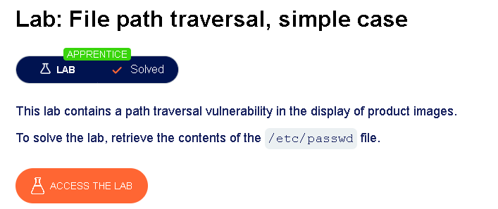
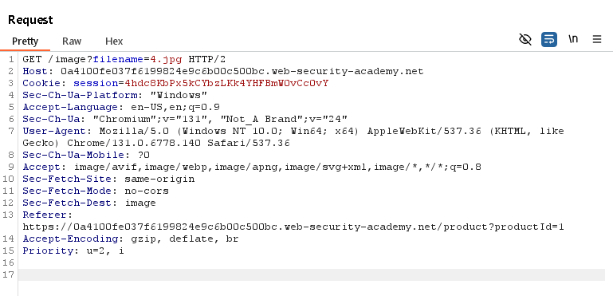
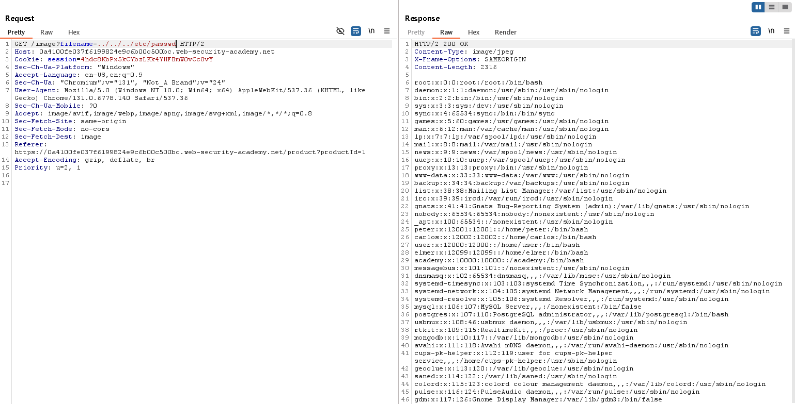

# Path Traversal

## What is Path Traversal?

**Path Traversal**, also known as **Directory Traversal**, is a web vulnerability that allows an attacker to access files and directories outside the application's intended location.

It occurs when an application uses user-supplied input to build a file path without properly validating or sanitising it. By manipulating this input, an attacker can traverse the server's directory structure and access files that should not be publicly available.

In simple terms, the attacker tricks the web application into reading files it was never intended to expose.

---

# Understanding Path Traversal with a Real-Life Example

Imagine visiting a large library.

You ask the librarian:

> "Can I have the book *Harry Potter* from the Fantasy section?"

The librarian retrieves:

```text
Library/
└── Fantasy/
    └── HarryPotter.pdf
```

Everything works as expected.

Now imagine the librarian follows every instruction you give without verifying whether you're allowed to access certain areas.

Instead, you say:

> "Go back one room... then another... then another... now bring me the manager's confidential salary records."

The path becomes:

```text
../
../
../
Manager/
SalaryRecords.pdf
```

Instead of retrieving a fantasy book, the librarian unknowingly gives you confidential documents.

This is essentially how a **Path Traversal attack** works.

---

# Technical Example

Suppose a web application loads images using the following request:

```html

```

On the server, the application might construct the file path like this:

```text
/var/www/images/218.png
```

The application simply appends the value of the `filename` parameter to the images directory.

If the application does **not** validate the supplied filename, an attacker can modify the request:

```text
../../../etc/passwd
```

The server then attempts to read:

```text
/var/www/images/../../../etc/passwd
```

After resolving the directory traversal sequences (`../`), the operating system interprets the path as:

```text
/etc/passwd
```

If access controls are missing, the application returns the contents of the `/etc/passwd` file instead of an image.

---

# Understanding `../`

The sequence

```text
../
```

means:

> Move **one directory up** from the current location.

For example:

Current directory:

```text
/var/www/images/
```

One level up:

```text
/var/www/
```

Two levels up:

```text
/var/
```

Three levels up:

```text
/
```

So a payload like:

```text
../../../etc/passwd
```

moves back to the filesystem root before navigating into the `etc` directory.

---

# Common Parameters That May Be Vulnerable

Although the PortSwigger lab uses the `filename` parameter, developers can use almost any parameter to reference files.

Common examples include:

```text
file
filename
path
filepath
dir
directory
folder
resource
page
template
include
module
view
document
download
attachment
image
img
avatar
icon
logo
css
style
js
script
theme
config
settings
log
backup
report
export
source
media
asset
content
```

Developers may also create custom parameter names such as:

```text
profilePic
resume
invoice
manual
thumbnail
cover
dataFile
xml
csv
pdf
```

Sometimes the parameter name doesn't even suggest that a file is being accessed.

Example:

```http
GET /api/get?id=42
```

Internally, the application may translate that request into:

```text
id=42
      ↓
/var/data/files/42.json
```

Although the parameter is named `id`, it ultimately determines which file is loaded.

---

# Lab: File Path Traversal – Simple Case

## Lab Objective

The objective of this lab is to exploit a file path traversal vulnerability and retrieve the contents of the `/etc/passwd` file.

The lab description is shown below.



---

## Capturing the Request

I launched **Burp Suite**, enabled **Intercept**, and clicked on one of the product images.

The intercepted request looked like this:



To make testing easier, I sent the request to the **Repeater** tab.

---

## Exploiting the Vulnerability

The original request contained the following parameter:

```text
filename=4.jpg
```

I modified it to:

```text
filename=../../../etc/passwd
```

and sent the request again.

The server responded with the contents of the `/etc/passwd` file, confirming that the application failed to validate the supplied file path.

The successful response is shown below.



---

# Key Takeaways

- Path Traversal allows an attacker to access files outside the intended directory.
- The vulnerability occurs when user input is used to construct file paths without proper validation.
- The `../` sequence instructs the operating system to move one directory higher.
- Sensitive files such as `/etc/passwd` are common targets on Linux systems.
- Burp Suite Repeater is useful for modifying and replaying requests during testing.
- Input validation and restricting file access to approved directories are essential to prevent this vulnerability.
