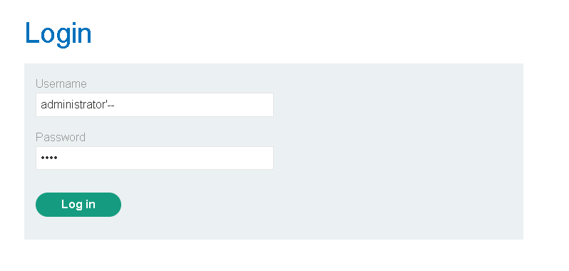

# Lab: SQL injection vulnerability allowing login bypass

This lab contains a SQL injection vulnerability in the login function.

To solve the lab, perform a SQL injection attack that logs in to the application as the administrator user.


To complete this lab first access it then go into my account section where you will see a login page input following credentials to gain administrator access.

```
Username - administrator'--
Password - (anything can be here)
```



Why this works?
What the background query looks like?
