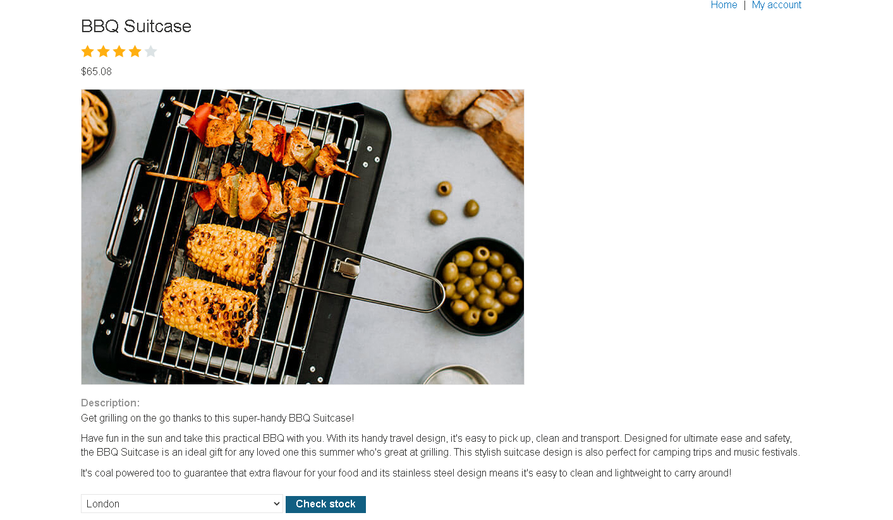
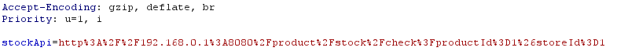
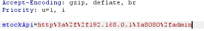
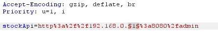
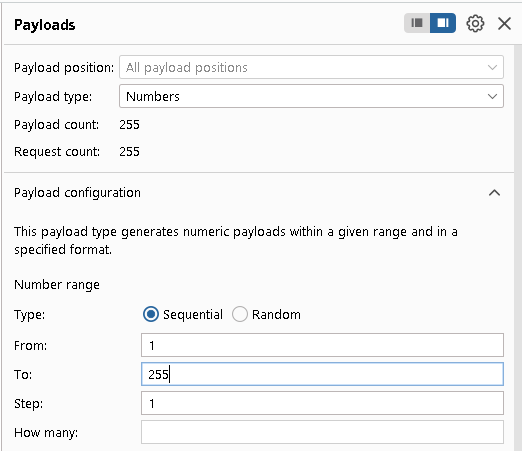
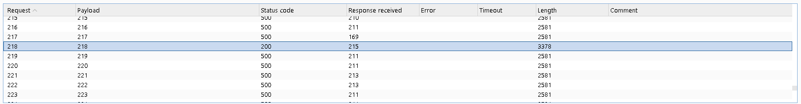
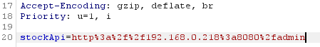
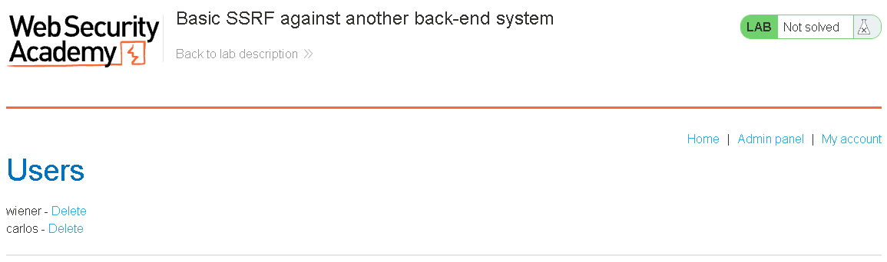

# SSRF Against Other Back-End Systems

Sometimes the interesting target isn't the application server itself, but the internal machinery sitting behind it. Most production environments have a whole layer of systems — databases, internal APIs, admin dashboards, monitoring tools, orchestration services — that were never meant to be reached from the public internet, so they're addressed with private, non-routable IPs (the `10.x.x.x`, `172.16.x.x`, and `192.168.x.x` ranges) instead of a real public address. Because these systems assume the network itself is the security boundary, they're frequently built with weak or nonexistent authentication of their own — nobody hardened the front door because, in theory, no one outside the network could ever knock on it.

That assumption breaks the moment a public-facing server can be tricked into making requests on someone else's behalf. If a vulnerable feature will fetch whatever URL it's handed, an attacker isn't limited to hitting `localhost` — they can just as easily point it at a private address like `192.168.0.68` and land on an internal admin interface that was built with zero login screen, because it was never supposed to need one. The application server, sitting inside the network with a route to that machine, does the attacker's reconnaissance and delivery for them. Worse, an attacker who doesn't already know the internal network layout can often map it by feeding the vulnerable parameter a range of private IPs and watching which ones respond differently (an internal SSRF-driven port/host scan), effectively using the vulnerable app as a probe to discover what's sitting behind the firewall before deciding where to strike.

## Real-World Example: ProxyLogon (Microsoft Exchange, 2021)

Microsoft Exchange Server splits its work across two layers: an internet-facing front-end that handles things like Outlook Web Access, and a set of back-end services that do the actual mail/calendar/admin processing. The front-end's only job is to work out which back-end URL a given request belongs to and forward it there — and it made that decision based on values the client supplied in a cookie, without properly checking them.

Researchers at DEVCORE found that by sending a single unauthenticated request with a forged `X-BEResource` cookie, an attacker could make the front-end proxy that request to *any* back-end URL of their choosing — and because the front-end talks to the back-end using its own trusted server identity, the forwarded request arrived pre-authenticated. The public-facing component effectively became a tunnel straight into infrastructure that was never designed to be reached from outside, the same private-network pivot described above, just happening inside Exchange's own internal architecture rather than a generic corporate LAN.

Tracked as CVE-2021-26855 and chained with a second bug that allowed writing an arbitrary file once inside, this became a pre-authentication remote code execution path. The HAFNIUM threat group exploited it in the wild starting in early 2021 to compromise tens of thousands of Exchange servers worldwide before Microsoft shipped emergency patches that March — one of the largest mass-exploitation incidents ever traced back to a single SSRF flaw.

---

## Lab Walkthrough: Basic SSRF Against Another Back-End System

**Source:** PortSwigger Web Security Academy
**Vulnerability class:** SSRF (internal network pivot)
**Goal:** Discover an admin interface hidden somewhere on the `192.168.0.X` internal range at port 8080, then use it to delete the user `carlos`.

### Setup

Same vulnerable feature as the loopback lab — a stock-check function that fetches whatever URL it's given via the `stockApi` parameter. This time the target isn't `localhost`, it's an unknown host somewhere on a private subnet, which means the first job is finding it.

### Steps

**1. Trigger the vulnerable request.**
With Burp's intercept on, I opened the lab, picked a random item, scrolled down, and hit **Check stock**.



**2. Capture the request.**
The intercepted `POST` carries the `stockApi` parameter at the end, pointing at the internal stock service:



**3. Point it at the internal subnet.**
I changed the `stockApi` value so it targets an address on the `192.168.0.X` range instead:



**4. Hand it to Intruder instead of forwarding.**
Rather than forwarding this one request, I sent it to Intruder and marked the last octet of the IP (the `1` in `192.168.0.1`) as the payload position — since I don't know which host on the subnet is actually running the admin panel, I need to sweep the whole range.



**5. Configure the attack.**
Attack type: **Sniper**. Payload type: **Numbers**, range **1–255**, covering every possible last octet on the subnet.



**6. Run it and look for the outlier.**
Once the attack finishes, one response stands out with a different content length from the rest — that's the host actually responding with something other than a generic error, which marks it as the live admin interface.



**7. Confirm it manually.**
I swapped the last octet of the `stockApi` value to the IP that produced the different-length response and forwarded the request:



**8. Land on the admin panel.**
The response now shows the internal admin interface, fully accessible with no login — including the username I need to target, `carlos`:



**9. Delete the user.**
Back at the stock-check request, I replaced the `stockApi` value with a URL-encoded call straight to the admin panel's delete endpoint:

```
stockApi=http%3a%2f%2f192.168.0.218%3a8080%2fadmin%2fdelete%3fusername%3dcarlos
```

Forwarding that request deletes `carlos` and solves the lab.

### Takeaway

This is the private-IP pivot from above, done step by step: the vulnerable app has network reach to a whole subnet the attacker can't otherwise touch, and because the exact internal host isn't known in advance, the same SSRF parameter that reaches `admin` also doubles as a scanning tool once it's dropped into Intruder. Response length is the tell — a host that isn't there or isn't listening on 8080 answers differently than the one actual admin panel does. It's the identical trust failure as ProxyLogon: a component with legitimate access to internal infrastructure gets repurposed by an outsider to reach systems that were never meant to answer to the public internet.
