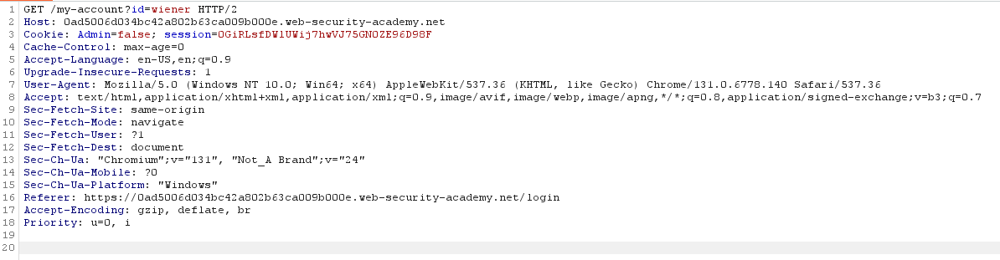
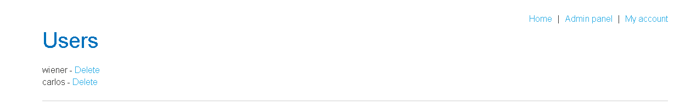

# Lab - User role controlled by request parameter

## Parameter-Based Access Control

Some web applications determine a user's permissions after they log in and store those permissions in locations that the **user can modify**. Instead of checking permissions securely on the server, the application trusts values sent by the user's browser.

These values may be stored in:

* Hidden form fields
* Cookies
* URL parameters (query strings)

For example, a website might use URLs like:

```
https://example.com/dashboard?admin=true
```

or

```
https://example.com/dashboard?role=1
```

The application reads these values to decide what features the user can access. This is a serious security flaw because users can simply change the parameter themselves.

For example, changing:

```
?admin=false
```

to

```
?admin=true
```

or

```
?role=0
```

to

```
?role=1
```

may grant access to administrator functionality if the server blindly trusts the value.

### Why is this insecure?

Anything stored in the browser belongs to the user. Users can edit cookies, hidden fields, and URL parameters using browser developer tools or interception tools such as Burp Suite.

If the server relies on these values to make authorization decisions, an attacker can simply modify them and gain privileges they should never have.

### Harry Potter Example 🧙

Imagine Hogwarts uses magical badges to decide who can enter the **Headmaster's Office**.

Every student receives a badge that says:

```
Role = Student
```

Before entering the office, the guard doesn't check Hogwarts' official records. Instead, he only looks at the badge.

Draco Malfoy scratches out **Student** and writes:

```
Role = Headmaster
```

The guard sees the badge and immediately allows him inside.

Obviously, this is a terrible security system because anyone can edit their own badge.

A secure system would ignore the badge and instead check Hogwarts' official records to verify the person's actual role.

> **Remember:** If the user can change it, the server should never trust it for authorization.

---

## Lab Walkthrough

For this lab, the following credentials are provided:

* **Username:** `wiener`
* **Password:** `peter`

The application contains an admin panel located at `/admin`, but it identifies administrators using a **forgeable cookie**. The objective is to modify this cookie so that the application treats us as an administrator and then delete the user **carlos**.

To solve the lab, we'll use **Burp Suite**.

First, open the lab and log in using the provided credentials (`wiener:peter`). Before clicking **Log in**, turn **Intercept** on in Burp Suite so the login request is captured.

The first intercepted request is a **POST** request containing the login credentials. Simply **Forward** this request.

The next request is a **GET** request that includes a cookie named `Admin` with the value set to `false`.



Since the application trusts this client-side cookie, change:

```
Admin=false
```

to

```
Admin=true
```

Then forward the modified request.

The application now believes we are an administrator and grants access to the admin functionality.

Navigate to the admin panel, locate the user **carlos**, and delete the account.



Once **carlos** has been deleted, the lab is successfully completed.

### Secure Approach

Applications should never determine a user's permissions using values that are stored on the client, such as cookies, hidden fields, or URL parameters. Instead, authorization should always be enforced on the **server side**, where users cannot tamper with the stored role or permission information.

Even if an attacker modifies a cookie like `Admin=true`, the server should ignore it and verify the user's actual role using trusted server-side data before granting access.
