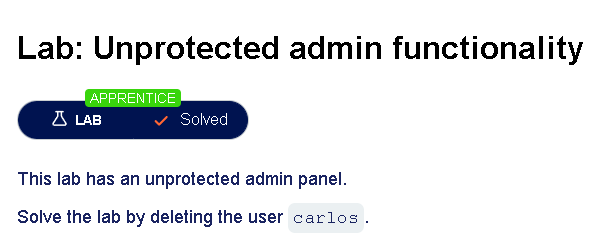
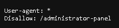
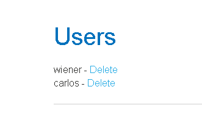

# Broken Access Control

> **OWASP Top 10 Category:** A01 — Broken Access Control
> A class of vulnerability where an application fails to properly enforce restrictions on what authenticated (or even unauthenticated) users are allowed to do.

## Table of Contents

- [Core Concepts](#core-concepts)
  - [Authentication](#authentication)
  - [Access Control (Authorization)](#access-control-authorization)
  - [Session Management](#session-management)
  - [Vertical Privilege Escalation](#vertical-privilege-escalation)
  - [Unprotected Functionality](#unprotected-functionality)
- [Concept Chaining](#concept-chaining)
- [Lab Walkthrough: Unprotected Admin Functionality](#lab-walkthrough-unprotected-admin-functionality)

---

## Core Concepts

### Authentication

The process of verifying that a user is who they claim to be — typically by checking a credential (password, token, biometric, certificate, MFA code) against what the system has on record.

**Question it answers:** *"Who are you?"*

Authentication happens before anything else. If it's weak or bypassable — weak passwords, no rate-limiting/lockout, predictable tokens, no MFA — an attacker can impersonate a legitimate user from the start.

### Access Control (Authorization)

The process of determining whether an *authenticated* user is permitted to perform a specific action or access a specific resource.

**Question it answers:** *"Now that I know who you are, what are you allowed to do?"*

Access control is enforced through rules and policies (roles, permissions, ownership checks) applied **server-side, on every request** — not just once at login.

**Common flaws:**
- Missing checks on individual endpoints
- Relying on hidden UI elements instead of server-side enforcement
- Trusting client-supplied data (e.g., a `role` parameter) without verification

### Session Management

The mechanism by which a system tracks an authenticated user across multiple requests, since HTTP is stateless and doesn't inherently "remember" you. After login, the server issues a session identifier (session cookie, JWT, token) that the client sends with each subsequent request.

**Common weaknesses:**
- Predictable session IDs
- Tokens that never expire
- Session IDs exposed in URLs
- Missing `Secure` / `HttpOnly` cookie flags
- Failure to invalidate sessions on logout

Any of these can let an attacker "steal" a valid session and impersonate the user without ever knowing their password.

### Vertical Privilege Escalation

A type of access control vulnerability where a lower-privileged user (e.g., a normal user) gains access to functionality or data reserved for higher-privileged users (e.g., an admin) — moving "up" the privilege hierarchy.

This usually happens because the application checks **authentication** ("are you logged in?") but fails to check **authorization** ("are you logged in as the right role?") for a given action.

> **Example:** A regular user manually navigates to `/admin/deleteUser`, and it works, because the server never re-verifies their role on that specific endpoint.

### Unprotected Functionality

Application features or endpoints that are fully functional but have **no access control check applied at all** — often because developers assumed the feature would stay "hidden" (obscure URL, no visible link in the UI) rather than actually enforcing permissions.

This is "security through obscurity" failing: if an attacker discovers or guesses the URL/endpoint/parameter, nothing stops them from using it, regardless of role or authentication status.

---

## Concept Chaining

These vulnerability classes rarely occur in isolation — they typically chain together in a real attack:

1. **Fake/steal authentication** — impersonate a trusted identity
2. **Maintain the session** — go undetected across multiple requests
3. **Abuse access control trust** — leverage privilege escalation to reach sensitive functionality
4. **Exploit unprotected functionality** — trigger a business-logic action that has no enforcement check behind it

Understanding each stage individually makes it much easier to spot where a real-world application's defenses break down.

---

## Lab Walkthrough: Unprotected Admin Functionality

**Objective:** Locate an unprotected admin panel and use it to delete the user `carlos`.

### Steps

1. **Check `robots.txt`.**
   Navigate to the lab and append `/robots.txt` to the URL. This file, placed at the root of a site, tells web crawlers which paths are allowed or disallowed for indexing — but it doesn't *enforce* anything, it just discloses them.

   

2. **Identify the disallowed path.**
   The `robots.txt` file lists a `Disallow` entry pointing to an admin-only path — a strong hint that a hidden admin panel exists at that URL.

3. **Navigate directly to the disclosed path.**
   Replace `/robots.txt` in the URL with the disclosed path (e.g., `/administrator-panel`) and load it directly.

   

4. **Confirm there's no access control check.**
   The panel loads fully — no login prompt, no role verification. This is the "unprotected functionality" flaw in action.

5. **Delete the user `carlos`** from the admin panel.

### Result

Lab solved — the admin panel was reachable and fully functional for an unauthenticated/unprivileged visitor, confirming a classic **unprotected functionality** vulnerability rather than a login or session flaw.

---

## Key Takeaway

Obscurity (`robots.txt` disallow rules, unlisted URLs, no UI links) is **not** access control. Every sensitive endpoint must independently verify **who** the caller is and **what** they're authorized to do — on the server, on every single request.
