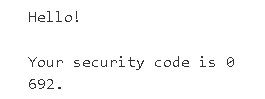

# Lab: 2FA simple bypass

To solve the lab we have to bypass the 2FA and we already got the credentials to another account. 

Your credentials: wiener:peter

Victim's credentials carlos:montoya

Now what i did is that i accessed the lab then go to my account page and login with the victim's credentials directly and it asked for the 4-digit code i go back to the login credentials page by clicking the back arrouw at the upper left and clicked it again then the my account button was visible so i clicked on it and solved the lab since it logs us in first then asked for the 4-digit code.

But Obviously that wasn't the right way............I mean it did solved the lab but in real world scenario it might differ or maybe not so let's just solve it how it is supposed to.

First login with the credentials given to your account and it will send you the 4-digit code to your email client and to see the code just click on the button appearing at the top named as "Email client".

And the code will appear as: -

After putting the code in the given field examine the URL you will see **/my-account?id=wiener** at the end.

Now log out from your account and login with the given victim's credentials. After logging in it will say about the 4-digit code it sended to the mail but we don't have access to the mail so how can we see the account. Well, just click on the URL and at the end add: - /my-account after removing /login2.

I added the **?id=carlos** as well but it is not necessary. And the lab is solved.
